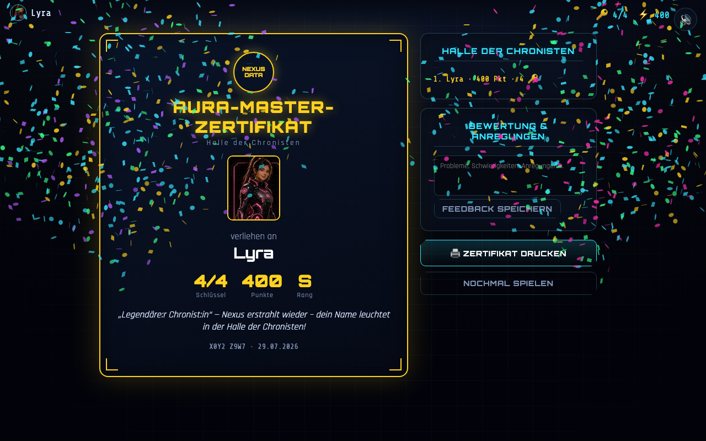

# Belohnung – Aura-Master-Zertifikat

Abschlussbildschirm nach allen vier Levels. Würdigt die Leistung und schließt die Mission ab.

**Aktueller Ist-Zustand (Umsetzung):**

> Vorlage: PDF-Folie „Belohnung“ (Aura-Master-Zertifikat, Halle der Chronisten,
> Ranking, Bewertung/Anregungen; Bild „3/3 Schlüssel gefunden“).

---

## Zweck

Erfolgserlebnis, Zusammenfassung der Leistung, Feedback einsammeln, Wiederspielanreiz.

## Layout & Elemente

- **Zertifikat** (goldgerahmt): ✅
  - Siegel „NEXUS DATA“, Titel „AURA-MASTER-ZERTIFIKAT“, Zeile „Halle der Chronisten“.
  - Avatar-Portrait, „verliehen an“ + **Codename** (oder Avatar-Name).
  - **Kennzahlen:** `Schlüssel X/4` · `Punkte` · `Rang (S/A/B/C)`.
  - **Rang-Spruch** (je nach Punktezahl), Fußzeile mit Klassen-Code + Datum.
- **Seitenspalte** (nicht im Druck): 🟡
  - **HALLE DER CHRONISTEN** – lokale Bestenliste (Name · Punkte · Schlüssel).
  - **BEWERTUNG & ANREGUNGEN** – Freitextfeld + „Feedback speichern“.
  - Buttons **„🖨 Zertifikat drucken“** und **„Nochmal spielen“**.
- **Konfetti** beim Betreten. 🟡

## Inhalte aus der Vorlage ✅

- Aura-Master-Zertifikat · Eintrag in der Halle der Chronisten · Bewertung & Probleme,
  Schwierigkeiten sowie Anregungen · Ranking mit erreichter Punkteanzahl.

## Ränge (nach Gesamtpunkten, max. 400) 🟡

| Rang | ab Punkten | Titel |
|------|-----------|-------|
| **S** | 360 | Legendäre:r Chronist:in |
| **A** | 280 | Meister-Archivar:in |
| **B** | 200 | Daten-Detektiv:in |
| **C** | 0   | Aura-Lehrling |

## Verhalten / Interaktion

- Beim ersten Betreten wird der Lauf **einmalig** in die Halle der Chronisten eingetragen. 🟡
- **Drucken** öffnet den Druckdialog; nur das Zertifikat wird gedruckt (Druck-Layout). 🟡
- **Nochmal spielen** setzt den Spielstand zurück → Startseite. 🟡
- **Feedback speichern** legt den Text lokal ab (`nexusdata.save.feedback`). 🟡

## Angenommene Entscheidungen (MVP)

- **Schlüssel „X/4“** statt „3/3“ (Bild in der Vorlage): im MVP 1 Schlüssel pro Level.
  🟡 *Änderbar*, siehe [allgemein.md](allgemein.md) §7.
- Rangstufen, Rang-Sprüche, Konfetti und das druckbare Zertifikat sind ergänzt. 🟡
- **Halle der Chronisten = lokale** Bestenliste (nur dieses Gerät/Browser). 🟡

## Umsetzung im MVP

- Markup: `game/index.html` → `section#screen-reward`
- Style: `game/css/style.css` → Abschnitt „REWARD / certificate“ + `@media print`
- Logik: `game/js/screens.js` → `renderReward()`, `rankFor()`, `renderHall()`, `saveFeedback()`
- Bestenliste: `game/js/state.js` → `getHall()`, `addToHall()`

## Offene Punkte & Iterationsideen

- 💡 **Klassenweite Bestenliste** (Backend) statt nur lokal.
- 💡 Zertifikat als PDF/Bild zum Download + personalisiertes Design.
- 💡 Feedback strukturierter erfassen (Skala + Kategorien) und exportierbar machen.
- 💡 Detail-Auswertung je Level (Fehlversuche, genutzte Tipps) auf dem Zertifikat/Bericht.
