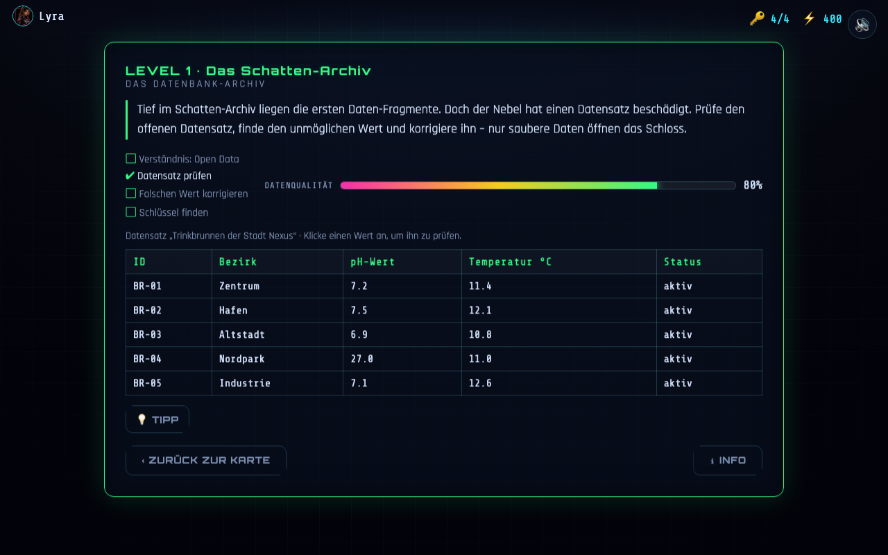

# Level 1 – Das Schatten-Archiv

**Untertitel:** Das Datenbank-Archiv · **Akzent:** Grün · **Lernfokus:** Was ist Open Data? Daten korrigieren

**Aktueller Ist-Zustand (Umsetzung):**

> Vorlage: PDF-Folie „Level 1: Das Schatten-Archiv“.

---

## Story (im Level)

> Tief im Schatten-Archiv liegen die ersten Daten-Fragmente. Doch der Nebel hat einen
> Datensatz beschädigt. Prüfe den offenen Datensatz, finde den unmöglichen Wert und
> korrigiere ihn – nur saubere Daten öffnen das Schloss.

## Lernziel

Verstehen, was **Open Data** ist, und dass Daten **korrekt/plausibel** sein müssen.

## Aufgaben (Checkliste) ✅ (aus der Vorlage)

1. Verständnis: Open Data
2. Passenden Datensatz prüfen
3. Falschen Wert korrigieren
4. Schlüssel finden

## MVP-Aufgabe (umgesetzt) 🟡

Ein offener Datensatz **„Trinkbrunnen der Stadt Nexus“** wird als Tabelle gezeigt
(ID, Bezirk, pH-Wert, Temperatur, Status). Eine Zeile enthält einen **unmöglichen Wert**
(pH = 27,0 – pH liegt nur zwischen 0 und 14).

- Spieler:in klickt Werte an, um sie zu prüfen (plausibel → Hinweis; der falsche Wert → Korrektur-Feld).
- Korrektur: ein Wert im **plausiblen** Trinkwasser-Bereich (6,5–8,5) löst das Level.
- Der **Datenqualitäts-Balken** steigt von 80 % auf 100 %; ein 🔑 erscheint.
- **Tipp-Button** verfügbar (kleiner Punktabzug).

### Beispieldaten (`NX.data.level1`)

| ID | Bezirk | pH | Temp °C | Status |
|----|--------|----|---------|--------|
| BR-01 | Zentrum | 7.2 | 11.4 | aktiv |
| BR-02 | Hafen | 7.5 | 12.1 | aktiv |
| BR-03 | Altstadt | 6.9 | 10.8 | aktiv |
| **BR-04** | **Nordpark** | **27.0 ⚠** | 11.0 | aktiv |
| BR-05 | Industrie | 7.1 | 12.6 | aktiv |

## Punkte 🟡

`100 − (Fehlklicks × 10) − (Tipps × 15)`, Untergrenze **40**.

## Info-Popup (ℹ) 🟡

Erklärt **Open Data** (frei nutzbar, oft von Städten/Behörden) und dass Werte plausibel
sein müssen (pH stets 0–14).

## Angenommene Entscheidungen (MVP)

- Konkreter Datensatz (Trinkbrunnen/pH), der eine Fehlerzelle, die Plausibilitätsregel
  und die Korrektur ergibt. 🟡
- „Passende Datensätze suchen“ aus der Vorlage ist im MVP zur **Prüfung einer Tabelle**
  vereinfacht. 🟡

## Umsetzung im MVP

- Logik: `game/js/levels/level1.js` · Daten: `game/js/data/datasets.js` → `level1`

## Iterationsideen 💡

- Mehrere Fehler pro Datensatz (mehrere Regeln: Temperatur, Datum, leere Felder).
- Vorgelagerte **Suche** aus mehreren Datensätzen den „passenden“ auswählen.
- „Golden Record“ aus mehreren widersprüchlichen Zeilen zusammenführen (Duplikate/Bereinigung).
- Datensatz thematisch an echte Wiener/OGD-Daten anlehnen.
