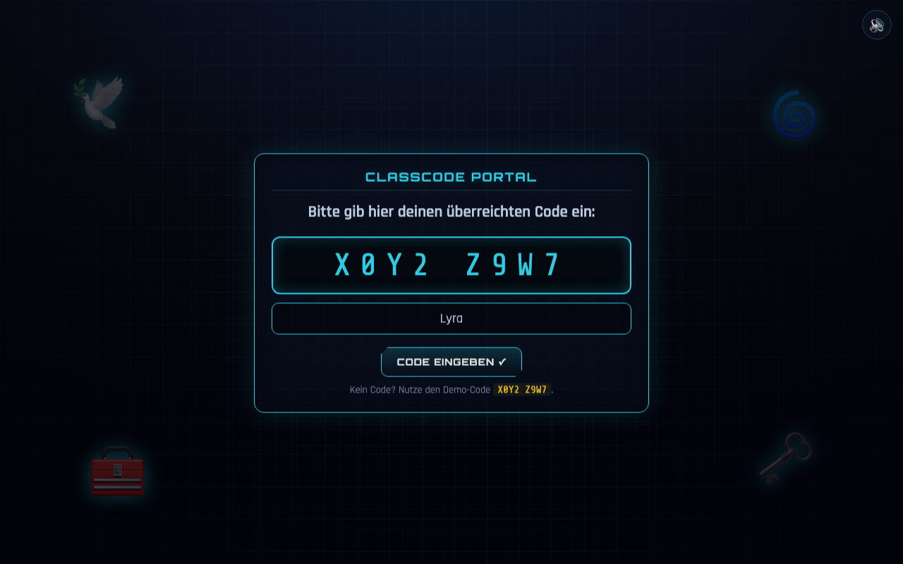

# Login – Classcode Portal

Zugang zum Spiel über einen von der Lehrkraft ausgegebenen **Klassen-Code**.

**Design-Vorgabe (Mockup):**

**Aktueller Ist-Zustand (Umsetzung):**

---

## Zweck

Niederschwelliger Einstieg: kein Konto, nur ein Klassen-Code („Access Terminal“).

## Layout & Elemente

- **Panel-Titel:** „CLASSCODE PORTAL“. ✅
- **Aufforderung:** „Bitte gib hier deinen überreichten Code ein:“. ✅
- **Code-Eingabefeld**, groß, Monospace, gesperrter Zeichenabstand; Platzhalter `X0Y2 Z9W7`. ✅
- **Button „CODE EINGEBEN ✓“**. ✅
- **Codename-Feld** (optional): „Dein Codename (optional)“. 🟡
- **Hinweis:** „Kein Code? Nutze den Demo-Code `X0Y2 Z9W7`.“ 🟡
- **Dekoration** (aus dem Mockup): Cyber-Taube, Schatztruhe, Labyrinth, Schlüssel –
  im MVP als dezente Symbole in den Ecken angedeutet. 🟡

## Verhalten / Interaktion

- **Leerer Code** → Fehlermeldung „Bitte gib einen Klassen-Code ein.“, kein Weiter. 🟡
- **Gültige Eingabe** → Code (Großbuchstaben) + Codename werden gespeichert → Avatar-Auswahl. ✅
- **Enter-Taste** in einem der Felder löst „CODE EINGEBEN“ aus. 🟡
- Beim erneuten Öffnen sind vorhandener Code/Codename vorausgefüllt. 🟡

## Angenommene Entscheidungen (MVP)

- **Code-Prüfung:** Der MVP akzeptiert **jeden nicht-leeren Code** (keine Serverprüfung).
  🟡 *Änderbar:* echte Prüfung gegen eine Liste/Backend, sobald gewünscht.
- **Codename** ist neu ergänzt, damit Zertifikat und Bestenliste personalisiert werden können.
  Ohne Eingabe wird der Avatar-Name verwendet. 🟡
- Der Demo-Code `X0Y2 Z9W7` stammt aus dem Mockup und dient als Beispiel. ✅

## Umsetzung im MVP

- Markup: `game/index.html` → `section#screen-login`
- Style: `game/css/style.css` → Abschnitt „LOGIN screen“
- Logik: `game/js/screens.js` → `renderLogin()`, `submitLogin()`

## Offene Punkte & Iterationsideen

- 💡 Echte Klassen-Codes (Backend/Datei) inkl. Ablaufdatum je Unterrichtseinheit.
- 💡 Formatmaske/Validierung des Codes (z. B. `XXXX XXXX`).
- 💡 Aufwändigere Dekoration entsprechend Mockup (illustrierte Symbole statt Emoji).
