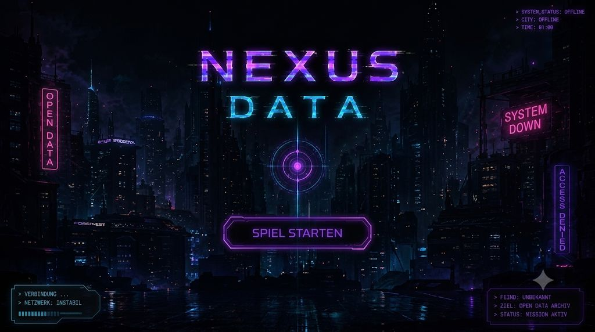
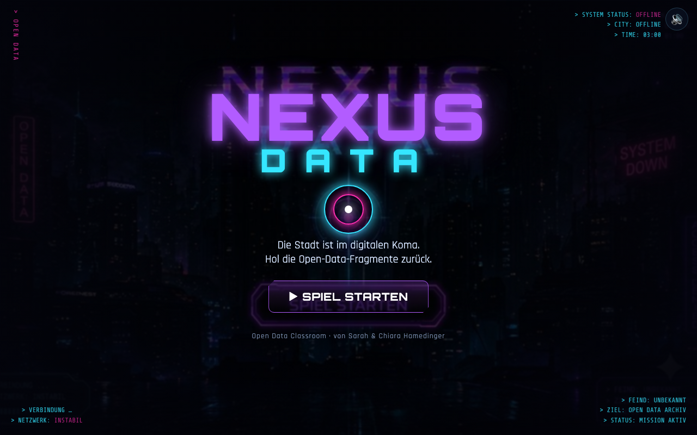

# Startseite

Erster Bildschirm des Spiels *NEXUS DATA*. Setzt Ton und Look und startet die Mission.

**Design-Vorgabe (Mockup):**

**Aktueller Ist-Zustand (Umsetzung):**

---

## Zweck

Neugier wecken, Atmosphäre („Stadt im digitalen Koma“) etablieren und ins Spiel führen.

## Layout & Elemente

- **Markenlogo** „**NEXUS**“ (violett) über „**DATA**“ (cyan, weit gesperrt), zentral, mit Glow. ✅
- Dahinter das Stadt-Hintergrundbild (`media/startseite.jpeg`), stark abgedunkelt. 🟡
- Dekorativer **Zielring** unter dem Logo. 🟡
- **Tagline:** „Die Stadt ist im digitalen Koma. Hol die Open-Data-Fragmente zurück.“ 🟡
- **Button „▶ SPIEL STARTEN“** (Primäraktion). ✅
- **HUD-Ecktexte** (Terminal-Flair, wie im Mockup): ✅
  - oben links (vertikal): `OPEN DATA`
  - oben rechts: `SYSTEM STATUS: OFFLINE` · `CITY: OFFLINE` · `TIME: 03:00`
  - unten links: `VERBINDUNG …` · `NETZWERK: INSTABIL`
  - unten rechts: `FEIND: UNBEKANNT` · `ZIEL: OPEN DATA ARCHIV` · `STATUS: MISSION AKTIV`
- **Credits:** „Open Data Classroom · von Sarah & Chiara Hamedinger“. 🟡

## Verhalten / Interaktion

- **SPIEL STARTEN** → Login. 
- Existiert bereits ein Spielstand (Avatar gewählt): 🟡
  - zusätzlicher Button **„⟳ WEITERSPIELEN“** → springt direkt zur Missionskarte.
  - der Startbutton heißt dann **„⟲ NEUES SPIEL“** und setzt nach Rückfrage den Fortschritt zurück.
- **Zeitanzeige `03:00`** ist bewusst an die Story angelehnt (Uhrzeit des Angriffs). 🟡

## Angenommene Entscheidungen (MVP)

- Das Mockup enthält bereits ein gerendertes „NEXUS DATA“. Im Spiel wird der Titel als
  **echter HTML-Text** über dem abgedunkelten Hintergrundbild dargestellt (scharf, skalierbar,
  animierbar) – nicht als Bild. 🟡
- Tagline, Zielring, Credits und die „Weiterspielen/Neues Spiel“-Logik sind ergänzt. 🟡

## Umsetzung im MVP

- Markup: `game/index.html` → `section#screen-start`
- Style: `game/css/style.css` → Abschnitt „START screen“
- Logik: `game/js/screens.js` → `renderStart()`, Button-Verkabelung in `init()`

## Offene Punkte & Iterationsideen

- 💡 Kleine Intro-Animation (Logo-Glitch, „Verbindung wird aufgebaut …“).
- 💡 Hintergrundmusik ab Startseite (mit Ton-Schalter).
- 🟡 Anzeige einer Sprach-/Klassenwahl, falls später mehrere Klassen/Sprachen nötig sind.
