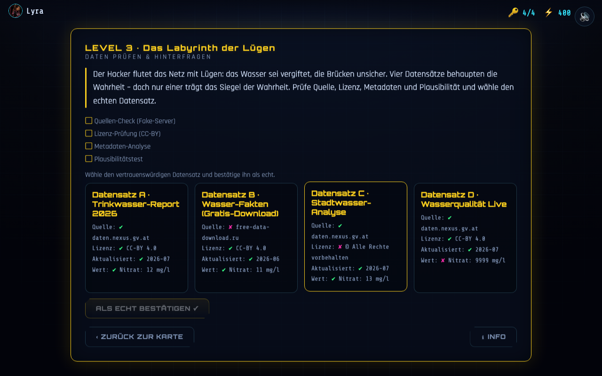

# Level 3 – Das Labyrinth der Lügen

**Untertitel:** Daten prüfen & hinterfragen · **Akzent:** Gelb · **Lernfokus:** Quelle, Lizenz, Metadaten, Plausibilität

**Design-Vorgabe (Mockup):**

**Aktueller Ist-Zustand (Umsetzung):**

> Vorlage: PDF-Folien „Das Labyrith der Lügen“ (Story) und „Level 3: Das Labyrinth der Lügen“
> (Aufgabe). Das Mockup zeigt den Weg der Daten (Raw Data → … → „Golden Record: The Right Data“).

---

## Story (Vorlage) ✅

> Der Hacker verfolgt von Anfang an einen perfiden Plan: Neben den Angriffen auf die Server hat er das Netz gezielt mit getarnten Gerüchten, gefälschten Mietdaten und zweifelhaften Lizenzen geflutet. Überall tauchen Webseiten und Schlagzeilen auf, die auf den ersten Blick echt wirken, aber bei genauerem Hinsehen voller Desinformation stecken.
 Die Stadt ist verunsichert, und um gegen diese Fake News anzukommen, reicht ein simples „Stimmt“ oder „Stimmt nicht“ längst nicht mehr aus. Man muss sich auf den verschiedenen Webseiten durchkämpfen, die Quellen checken und herausfinden, welche Meldung solide belegt ist, welche völlig widerlegt wurde oder wo wichtige Beweise noch unklar sind.
# 🎮 LEVEL 3 · DAS LABYRINTH DER LÜGEN
### DOKUMENTATION & CONTENT-SPEZIFIKATION

 **Lernziel:** Lerne, Datenberichte kühnen Blickes zu prüfen. Eine offene Lizenz macht Daten nicht automatisch wahr, ein schickes Profil ist noch kein Beweis und fehlende Belege machen eine These noch nicht automatisch zur Lüge!

---

## 🎨 1. DESIGN-SYSTEM & VISUELLER STIL (LAUT VS-CODE-THEME)

**Hintergrund:** Dunkles Midnight-Blue / Slate (#0a0e17) mit dezentem Cyber-Gitter (rgba(0, 243, 255, 0.05)) und feinen Platinen-Linien im Hintergrund.
**Haupt-Farbe (Vordergrund & UI):** Neonblau / Cyan (#00f3ff).
**Akzent-Glow (Leuchteffekt):** Äußeres Leuchten (box-shadow: 0 0 15px rgba(0, 243, 255, 0.4)).
**Schriftart:** Monospace (Fira Code, Roboto Mono, Courier New).
**Level-Rahmen & Highlights:** * Haupt-Level-Rahmen: Neon-Gelb (#ffd700) mit Glow (box-shadow: 0 0 15px rgba(255, 215, 0, 0.3)).
  * 🟢 **BELEGT:** Neon-Grün (#39ff14)
  * 🟡 **UNKLAR:** Neon-Gelb/Orange (#f59e0b)
  * 🔴 **WIDERLEGT:** Neon-Rot (#ef4444)

---

## 🌀 2. INTERAKTIVES LABYRINTH- & AVATAR-KONZEPT

### 🏃 Avatar-Integration & Weg-Visualisierung
1. **Charakter-Nutzung:** Der vom Spieler zu Beginn gewählte Avatar (z. B. Cyber-Hero, Roboter, Agent) ist als Spielfigur im Labyrinth aktiv.
2. **Mini-Map (Vogelperspektive):**
   * Das Labyrinth liegt als Cyber-Raster im Hintergrund.
   * Der Avatar startet am Eingang des Labyrinths.
   * Bei jeder richtigen Antwort läuft der Avatar weiter in Richtung Zentrum. Hinter ihm zieht sich ein **neon-cyaner Laser-Strahl (#00f3ff)** als sichtbarer, leuchtender Pfad durch das Labyrinth, der zeigt, wo man hergekommen ist.
3. **Gang-Ansicht (Ego- / Korridor-Perspektive):**
   * Im Zentrum des Bildschirms befindet sich die Gang-Ansicht.
   * Nach jeder gelösten Frage startet eine kurze **Lauf-Animation**: Der Avatar bewegt sich durch den Gang nach vorne, die Wände bewegen sich seitlich vorbei, und er bleibt am nächsten Entscheidungspunkt stehen, wo die neue Frage aufploppt.

### 🎁 Finale im Zentrum (Frage 6 gelöst)
Der Avatar erreicht mit dem leuchtenden Strahl direkt die Mitte des Labyrinths.
Eine geschlossene **Cyber-Schatztruhe** wird sichtbar.
**Animation:**
  1. Die Schatztruhe beginnt in gold-cyanem Licht zu glühen (#ffd700 / #00f3ff).
  2. Die Truhe klappt animiert auf.
  3. Der **Golden Record Schlüssel** schwebt mit Partikel-Effekten nach oben heraus.
  4. Der Avatar führt eine Jubel-Animation aus und greift nach dem Schlüssel.
  5. **Pop-up:** „Glückwunsch! Du hast das Labyrinth der Lügen durchquert und den Golden Record freigeschaltet!“

---

## 💡 3. DAS 2-STUFEN-HILFESYSTEM (UI-LOGIK)

Unter jeder Aufgabenkarte befinden sich zwei interaktive Hilfe-Buttons:
1. ℹ️ **„Info-Button“ (Kostenlos / 0 Pkt.):** Erklärt das methodische Prinzip / den Fachbegriff (z. B. Was sind Metadaten/CC-Lizenzen?), ohne die Antwort zu verraten.
2. 💡 **„Tipp-Button“ (-50 Pkt.):** Gibt einen konkreten fachlichen Hinweis zur aktuellen Meldung.

> **Umsetzung ab v0.6.0 – Punktabzug angepasst:** Die −50 Pkt. beziehen sich auf ein
> Budget von 6 × 100 = 600 Punkten (≈ 8,3 %). Das Spiel rechnet aber mit **100 Punkten
> pro Level**; dort entsprechen 8,3 % rund **−10 Punkten**. Umgesetzt sind daher
> **−10 je Tipp** (und −8 je Fehlversuch, Untergrenze 40) – verhältnisgleich zur Spec und
> einheitlich mit den anderen Levels. Wörtlich −50 gegen 100 hätte den Tipp-Button nach
> zwei Klicks unbrauchbar gemacht. Ein bereits bezahlter Tipp ist erneut kostenlos.

---

## 📄 4. COMPLETE CONTENT-SPEZIFIKATION (FRAGEN 1 BIS 6)

### 📋 DEINE PRÜF-CHECKLISTE
[ ] **1. Quellencheck:** Gefälschtes Datenportal vs. offizielle Domain (.gov / Impressum)
[ ] **2. Lizenz-Check:** Regelt nur die Nutzung (CC0, CC-BY) – **kein** Wahrheitsstempel!
[ ] **3. Metadaten-Analyse:** Berichtszeitraum vs. tatsächliches Erstellungsdatum
[ ] **4. Plausibilitätstest:** Abgleich mit unabhängigen Live-Sensoren & Realität

---

### 🎮 FRAGE 1 / 6: Trinkwasser-Qualität
(Thema: Quellencheck & Verifizierung)

**Meldung im Feed:** > **💧 Wasserwerk_Stadt_Nexus** (blauer Haken) > „Unser aktueller Prüfbericht bestätigt: Das Trinkwasser erfüllt alle Grenzwerte. Den vollständigen Bericht gibt es auf unserer Website.“

**Fakten-Check (Details):**
  * 🌐 **Quelle & Portal:** Profil verweist auf wasserwerke.nexus.gov/daten/analyse-2026 (verifizierte Behörden-Domain mit Impressum).
  * 🏷️ **Metadaten:** Stand: Gestern, 08:30 Uhr | Dateiformat: .json
  * 📜 **Lizenz & Rohdaten:** **CC0** (Public Domain) | Vollständige Labor-Rohdaten angehängt.
  * 🧠 **Plausibilität:** Nitrat- und pH-Messergebnisse sind stabil und decken sich mit historischen Daten.

**HILFE-SYSTEM:**
  * ℹ️ **INFO (Kostenlos / 0 Pkt.):** **Begriffs-Guide:** Ein blauer Haken auf Social Media beweist noch nicht, dass eine Meldung stimmt. Achte auf die verlinkte Web-Adresse (Domain): Behörden nutzen geschützte Endungen wie .gov. Die Lizenz **CC0** erlaubt jedem die freie Weiterverwendung, sagt aber nichts über die Inhalts-Richtigkeit aus.
  * 💡 **TIPP (-50 Pkt.):** Die Quelle ist eine echte städtische Domain, die Rohdaten liegen vollständig vor und die Werte passen zur Historie. Der Bericht ist voll abgedeckt.

**DEINE BEWERTUNG:**
  - [x] 🟢 **BELEGT** (Quellen-, Metadaten- und Rohdatenprüfung bestanden)
  - [ ] 🟡 **UNKLAR / ZU WENIG DATEN**
  - [ ] 🔴 **WIDERLEGT**

---

### 🎮 FRAGE 2 / 6: Brückeneinsturz-Warnung
(Thema: Nachgeahmte Webseiten / Gefälschtes Datenportal)

**Meldung im Feed:** > **🕶️ DarkBridge_Leaks** > „Eil-Warnung! Die Hauptbrücke über den Nexus-Fluss bricht morgen ein! Ich habe geheime Messdaten bekommen. Glaubt mir einfach!“

**Fakten-Check (Details):**
  * 🌐 **Quelle & Portal:** Link führt auf ein nachgeahmtes Portal file-drop-temp.net/nexus/download.pdf. Kein Impressum, kein Herausgeber.
  * 🏷️ **Metadaten:** Erstellungsdatum der Datei fehlt komplett | Urheber: Anonym
  * 📜 **Lizenz & Rohdaten:** Keine Lizenz vorhanden | Nur ein Text-Screenshot, keine Rohdaten.
  * 🧠 **Plausibilität:** Ein Quervergleich mit dem offiziellen Geoportal der Stadt zeigt: Die echten Echtzeit-Brückensensoren melden absolut normale Belastungswerte.

**HILFE-SYSTEM:**
  * ℹ️ **INFO (Kostenlos / 0 Pkt.):** **Begriffs-Guide:** Anonyme Filehoster (file-drop...) sind keine verlässlichen Datenportale. Wenn Behauptungen aufgestellt werden, die den offiziellen Live-Sensoren der Stadt widersprechen, ist die Meldung fachlich entkräftet.
  * 💡 **TIPP (-50 Pkt.):** Anonymer Upload-Server, fehlende Metadaten und ein direkter Widerspruch zu den echten städtischen Messsensoren – diese Panikmeldung ist klar falsch.

**DEINE BEWERTUNG:**
  - [ ] 🟢 **BELEGT**
  - [ ] 🟡 **UNKLAR / ZU WENIG DATEN**
  - [x] 🔴 **WIDERLEGT** (Widerspricht den tatsächlichen Echtzeit-Sensordaten)

---

### 🎮 FRAGE 3 / 6: Feinstaub-Rekord an der Schule
(Thema: Lizenzoffenheit vs. Inhaltliche Richtigkeit)

**Meldung im Feed:** > **🏫 Eltern-Initiative_Nexus** > „Achtung! Die Feinstaubwerte vor dem Schulzentrum Nexus-West haben heute gefährliche Rekordhöhen erreicht.“

**Fakten-Check (Details):**
  * 🌐 **Quelle & Portal:** Private Vereins-Website nexus-eltern-initiative.org
  * 🏷️ **Metadaten:** Veröffentlicht: Heute, 12:00 Uhr | Urheber: Elternverein Nexus
  * 📜 **Lizenz & Rohdaten:** **CC-BY 4.0** sauber im Fußbereich angegeben. Es fehlen jedoch jegliche Rohdaten-Downloads!
  * 🧠 **Plausibilität:** Im Beitrag wird nur ein einzelner Zahlenwert genannt. Es gibt keine Angaben zur Messmethode, zum verwendeten Sensor oder zum genauen Standort.

**HILFE-SYSTEM:**
  * ℹ️ **INFO (Kostenlos / 0 Pkt.):** **WICHTIGER LIZENZ-HINWEIS:** Eine Lizenz (wie CC-BY) regelt rein rechtlich, wie Daten weiterverwendet werden dürfen. Sie ist **KEIN** Qualitätssiegel dafür, ob die Daten wahr oder vollständig sind! Ohne Rohdaten und Messprotokoll kann der Wert weder bewiesen noch widerlegt werden.
  * 💡 **TIPP (-50 Pkt.):** Die Angabe von CC-BY ist vorbildlich, aber der eigentliche Beleg fehlt! Ein einzelner Textwert ohne Rohdaten ist unvollständig. Reicht das für „Belegt“ oder „Widerlegt“?

**DEINE BEWERTUNG:**
  - [ ] 🟢 **BELEGT**
  - [x] 🟡 **UNKLAR / ZU WENIG DATEN** (Fehlende Belege machen eine These noch nicht falsch, aber auch nicht belegt!)
  - [ ] 🔴 **WIDERLEGT**

---

### 🎮 FRAGE 4 / 6: Lagebericht Stromnetz
(Thema: Metadaten-Analyse & Zeit-Kontext)

**Meldung im Feed:** > **⚡ Nexus_Energy** > „Eil-Meldung! Aktueller Lagebericht zur kritischen Überlastung und drohenden Ausfällen im städtischen Stromnetz.“

**Fakten-Check (Details):**
  * 🌐 **Quelle & Portal:** Verlinkung auf das echte Open-Data-Portal open-data.nexus-energy.io.
  * 🏷️ **Metadaten:** Im Beitrag steht „Messwerte aktuell von heute“. Der Datei-Header und die Versions-Metadaten zeigen aber als Berichtszeitraum: 14. November 2018.
  * 📜 **Lizenz & Rohdaten:** **CC-BY 4.0** | CSV-Rohdatensatz liegt vor.
  * 🧠 **Plausibilität:** Die Messwerte beschreiben eine reale Netzüberlastung, allerdings aus dem Jahr 2018.

**HILFE-SYSTEM:**
  * ℹ️ **INFO (Kostenlos / 0 Pkt.):** **Begriffs-Guide:** Metadaten sind Angaben über die Daten (z. B. Erstellungsdatum, Berichtszeitraum). Oft werden echte, alte Daten genommen und durch falsche Überschriften als „aktuelle Krise“ verkauft.
  * 💡 **TIPP (-50 Pkt.):** Die Rohdaten sind echt, aber der behauptete Berichtszeitraum („Heute“) widerspricht den Metadaten der Datei (2018). Die Behauptung einer aktuellen Krise ist damit falsch.

**DEINE BEWERTUNG:**
  - [ ] 🟢 **BELEGT**
  - [ ] 🟡 **UNKLAR / ZU WENIG DATEN**
  - [x] 🔴 **WIDERLEGT** (Alte Daten werden irreführend als aktuelle Notlage verkauft)

---

### 🎮 FRAGE 5 / 6: Tram-Ausfall wegen Baustelle
(Thema: Standardisierte Datenformate & Quervergleich)

**Meldung im Feed:** > **🚌 Verkehrsbetriebe_Nexus** > „Wegen Gleisarbeiten auf der Hauptstraße fährt die Tram-Linie 3 am kommenden Wochenende nicht.“

**Fakten-Check (Details):**
  * 🌐 **Quelle & Portal:** Offizielle Stadt-Domain mobilitaet.nexus.gov/fahrplan
  * 🏷️ **Metadaten:** Stand: Vor 2 Stunden | Herausgeber: Pressestelle Verkehrsbetriebe
  * 📜 **Lizenz & Rohdaten:** **CC-BY 4.0** | Fahrplandaten liegen im offenen Standard-Format **GTFS** / **JSON** vor.
  * 🧠 **Plausibilität:** Der angegebene Baustellenzeitraum deckt sich exakt mit dem Eintrag im städtischen Tiefbauamt.

**HILFE-SYSTEM:**
  * ℹ️ **INFO (Kostenlos / 0 Pkt.):** **Begriffs-Guide:** **JSON** und **GTFS** sind offene, maschinenlesbare Datenformate. Sie ermöglichen es z. B. Karten-Apps, Fahrpläne automatisch einzulesen. Stimmige Daten von zwei Behörden (Verkehrsbetriebe + Tiefbauamt) sichern die Meldung ab.
  * 💡 **TIPP (-50 Pkt.):** Domain verifiziert, Datenformat offen und ein unabhängiger Abgleich mit dem Tiefbauamt bestätigt die Baustelle. Alles ist sauber belegt.

**DEINE BEWERTUNG:**
  - [x] 🟢 **BELEGT** (Echte Quelle, offenes Datenformat & doppelt abgesichert)
  - [ ] 🟡 **UNKLAR / ZU WENIG DATEN**
  - [ ] 🔴 **WIDERLEGT**

---

### 🎮 FRAGE 6 / 6: Waldrodung im Stadtpark
(Thema: Fehlinterpretation echter Daten)

**Meldung im Feed:** > **🌳 Nexus_Watch** > „Satellitenbild entlarvt die Stadt! Die Hälfte aller Bäume im Nexus-Stadtpark wurde heimlich gerodet.“

**Fakten-Check (Details):**
  * 🌐 **Quelle & Portal:** Echtes Geoportal geoportal.nexus.gov/satellit/stadtpark
  * 🏷️ **Metadaten:** Bildeigenschaften der .tiff-Datei zeigen Aufnahmedatum: 15. Januar. Im Text wird behauptet: „Sommer-Luftbild“.
  * 📜 **Lizenz & Rohdaten:** **CC-BY 4.0** | Hochaufgelöste Satellitenbild-Datei vorhanden.
  * 🧠 **Plausibilität:** Die Aufnahme zeigt unbelaubte, kahle Baumkronen im tiefsten Winter, was fälschlicherweise als Rodung interpretiert wird.

**HILFE-SYSTEM:**
  * ℹ️ **INFO (Kostenlos / 0 Pkt.):** **Begriffs-Guide:** Ein Foto oder Datensatz kann zu 100 % echt sein – aber durch falsche Erklärungen verdreht werden. Prüfe bei Bildern immer die Metadaten (Aufnahmedatum/Jahreszeit) und frage dich: Passt die Erklärung zur Realität?
  * 💡 **TIPP (-50 Pkt.):** Das Bild ist echt und stammt vom städtischen Portal, aber das Datum (Januar) zeigt: Hier sieht man nur Laubbäume im Winter. Die Behauptung einer „Rodung“ ist widerlegt.

**DEINE BEWERTUNG:**
  - [ ] 🟢 **BELEGT**
  - [ ] 🟡 **UNKLAR / ZU WENIG DATEN**
  - [x] 🔴 **WIDERLEGT** (Echtes Bild aus dem Winter wird fälschlich als Baumrodung dargestellt)

## 🛠️ 5. WEITERE DIDAKTISCHE ANPASSUNGEN (LEVEL 1 & GLOSSAR)

### 🛠️ Didaktische Anpassung für Level 1 (pH-Wert Fehler-Korrektur)
**Problem bisher:** Spieler finden einen fehlerhaften pH-Wert (z. B. 14) und ersetzten ihn durch einen erfundenen Zahlenwert (z. B. 7.2).
**Neue didaktische Lösung:**
  1. Der unplausible Wert wird vom Spieler als **„Ungültig / Fehlerhaft“** markiert.
  2. **Auswahlmenü zur Behebung:**
     * [ A ] Wert durch eine plausible Vermutung ersetzen (FALSCH – Wir erfinden keine Messwerte!)
     * [ B ] Wert als "Fehlend (NULL)" markieren und Nachmessung beim Sensor anfordern (RICHTIG).

---

### 💡 Cyber-Glossar (Im Pause-Menü jederzeit aufrufbar)
**API / Token:** Ein digitaler Schlüssel, mit dem Programme Daten direkt von einem Server abrufen.
**JSON / CSV:** Standard-Dateiformate für Tabellen und Datenstrukturen.
**CC0 / CC-BY:** Rechte-Lizenzen. Regelt nur, wer die Daten wie nutzen darf (**kein** Wahrheitsstempel!).
**Metadaten:** Daten über Daten (Erstellungsdatum, Urheber, Dateiformat).