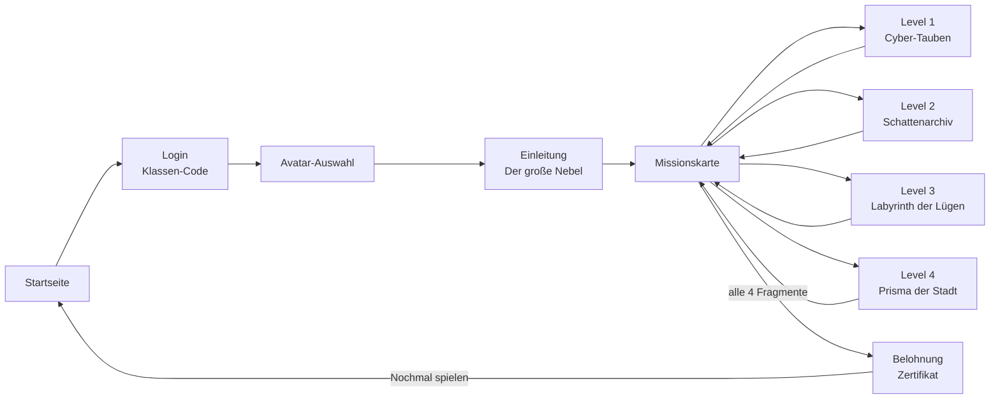

# NEXUS DATA – Überblick (Ablauf & Architektur)

Diese Datei verbindet alle Einzel-Specs zu einem Gesamtbild. Sie beschreibt den
Spielablauf, den gespeicherten Spielzustand und wie die Bausteine zusammenspielen.
Grundlagen & Konventionen: [allgemein.md](allgemein.md).

---

## 1. Spielablauf



- Levels werden **der Reihe nach freigeschaltet**: Level *n* ist spielbar, sobald
  Level *n‑1* abgeschlossen ist. ✅
- Abgeschlossene Levels dürfen erneut geöffnet werden (bester Punktestand zählt). 🟡
- Nach Abschluss **aller** Levels erscheint der Weg zur Belohnung. ✅

## 2. Bildschirm-Übersicht

| # | Bildschirm | Spec | Mockup | Ist-Zustand |
|---|---|---|---|---|
| 1 | Startseite | [startseite.md](startseite.md) | `images/startseite.jpeg` | `images/screens/startseite.png` |
| 2 | Login (Klassen-Code) | [login.md](login.md) | `images/login.png` | `images/screens/login.png` |
| 3 | Avatar-Auswahl | [avatar.md](avatar.md) | `images/avatar.png` | `images/screens/avatar.png` |
| 4 | Einleitung | [einleitung.md](einleitung.md) | *(nur PDF)* | `images/screens/einleitung.png` |
| 5 | Missionskarte | [missionskarte.md](missionskarte.md) | *(neu)* | `images/screens/missionskarte.png` |
| 6 | Level 1–4 | [levels/README.md](levels/README.md) | `images/Labyrinth.jpeg` (Lvl 3) | `images/screens/level-1..4.png` |
| 7 | Finale (Zeremonie) | [belohnung.md](belohnung.md) | *(neu)* | *(noch kein Screenshot)* |
| 8 | Belohnung / Zertifikat | [belohnung.md](belohnung.md) | *(nur PDF)* | `images/screens/belohnung.png` |

Übergreifend (kein eigener Bildschirm): **Info-/Tipp-System** → [info.md](info.md).

## 3. Spielzustand (gespeichert in `localStorage`)

Schlüssel `nexusdata.save`:

```jsonc
{
  "classCode": "X0Y2 Z9W7",   // eingegebener Klassen-Code
  "name": "Lyra",              // Codename (optional)
  "avatarId": "lyra",          // lyra | lennox | zen
  "completed": [1, 2],          // abgeschlossene Level-IDs (= Schlüssel)
  "scores": { "1": 90, "2": 100 }, // bester Punktestand je Level
  "bonuses": { "1": 15 },      // Wissens-Bonus je Level (0 = falsch beantwortet,
                               //   Schlüssel vorhanden = Frage verbraucht)
  "awards": ["open-data-hero"],// dauerhaft freigeschaltete Auszeichnungen
  "openDataSets": 5,           // korrekt freigegebene Open-Data-Szenarien (Leaderboard)
  "feedback": "",              // Freitext aus dem Belohnungsbildschirm
  "startedAt": 0,               // Zeitstempel Spielbeginn
  "hallSaved": false            // schon in die Halle der Chronisten eingetragen?
}
```

Weitere Schlüssel: `nexusdata.hall` (Klassen-Bestenliste, bis 200 Einträge, lokal;
Export/Import auf dem Endscreen) · `nexusdata.muted` (Ton an/aus) ·
`nexusdata.music` (Hintergrundmusik an/aus).

Abgeleitete Werte: **Schlüssel** = Anzahl `completed`; **Gesamtpunkte** = Summe `scores` **+** Summe `bonuses`;
**Rang** = Anteil an der erreichbaren Gesamtpunktzahl (siehe [allgemein.md](allgemein.md) §7).

## 4. Wiederkehrende UI-Bausteine

- **HUD** (oben, ab Missionskarte): Avatar-Chip, `🔑 X/4`, `✨ Bonus`, `⚡ Punkte`.
- **Fortschritts-Balken** (Missionskarte): abgeschlossene Levels / 4.
- **Datenqualitäts-Balken** (in Levels, wo sinnvoll): 0–100 %.
- **Info-Popup** (ℹ): erklärt den Fachbegriff des jeweiligen Levels (Glossar).
- **Ton-Schalter** (🔊/🔇, immer oben rechts) – Hauptschalter: Effekte, Sprachausgabe,
  Aufnahmen **und** Musik.
- **Musik-Schalter** (🎵, daneben) – schaltet nur die Hintergrundmusik; erscheint erst,
  wenn eine Musikdatei vorliegt (siehe [levels/musik.md](levels/musik.md)).
- **Toast**-Meldungen für kurze Rückmeldungen.

## 5. Level-Framework (Kurzfassung)

Levels sind **einsteckbare Bausteine**. Ein Level ist ein Objekt mit Metadaten
(`title`, `story`, `tasks`, `accent`, `info`, …) und einer `mount(container, ctx)`-Funktion,
die die Aufgabe aufbaut und bei Erfolg `ctx.complete(punkte)` aufruft. Missionskarte,
Freischaltung, HUD, Punkte und Zertifikat lesen alles aus der Level-Registrierung.
Vollständiger Vertrag: [levels/README.md](levels/README.md).

## 6. MVP-Status & Roadmap

**Im MVP enthalten (spielbar von Start bis Zertifikat):**
- Alle 7 Bildschirme, 3 Avatare, 4 Levels mit je *einer* kleinen echten Aufgabe.
- Punkte/Schlüssel/Rang, Halle der Chronisten, druckbares Zertifikat, Feedback-Feld.
- Ton-Effekte, Info-Popups, Fortschritts- & Datenqualitäts-Balken, Konfetti.
- **Sprachausgabe** (ab v0.10.0): Tipps, Hilfe- und Info-Texte haben **einen**
  Vorlese-Knopf, der nur auf Knopfdruck startet. Eine Zuordnungstabelle
  (`game/js/data/voice.js`) entscheidet je Textstelle zwischen hinterlegter Aufnahme
  und Browser-Stimme – siehe [stimme.md](stimme.md). Die Story wird nicht vorgelesen.

**Bewusst noch offen (Kandidaten für die Iteration):**
- Vertiefte Level-Aufgaben (mehrere Teilschritte pro Level, mehr Datensätze). 💡
- Echte Open-Data-Quellen statt Beispieldaten (optional, online). 💡
- Klassen-Code serverseitig prüfen / Lehrkraft-Dashboard. 💡
- Hintergrundmusik, mehr Animationen, Avatar-spezifische Fähigkeiten mit Spieleffekt. 💡
- Barrierefreiheit (Tastatur/Screenreader/Kontrast) formal prüfen. 💡

## 7. Verhältnis Spec ↔ Code

- **Spec (`story/`)** = Wahrheit über *Absicht & Verhalten*.
- **Code (`game/`)** = aktuelle Umsetzung. Jede Spec nennt unter „Umsetzung im MVP“
  die relevanten Dateien.
- Bei Änderungen: zuerst die betroffene Spec anpassen, dann den Code – so bleibt
  `story/` als KI-Input verlässlich.
