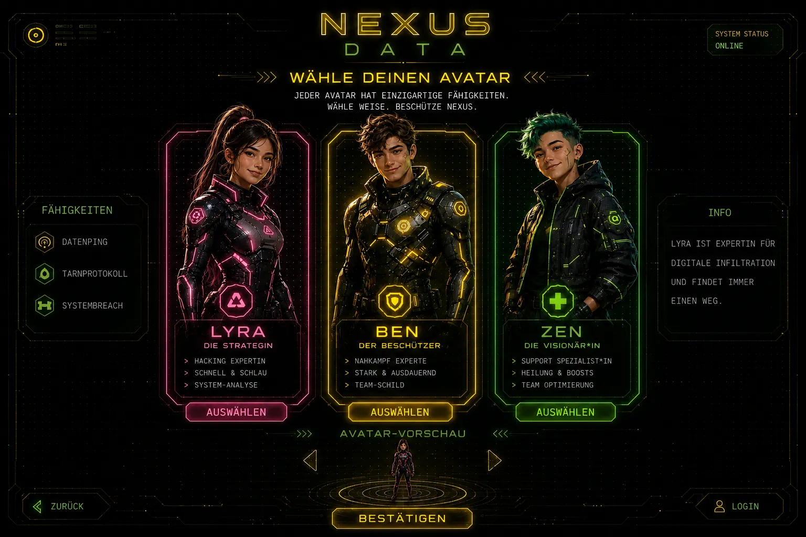
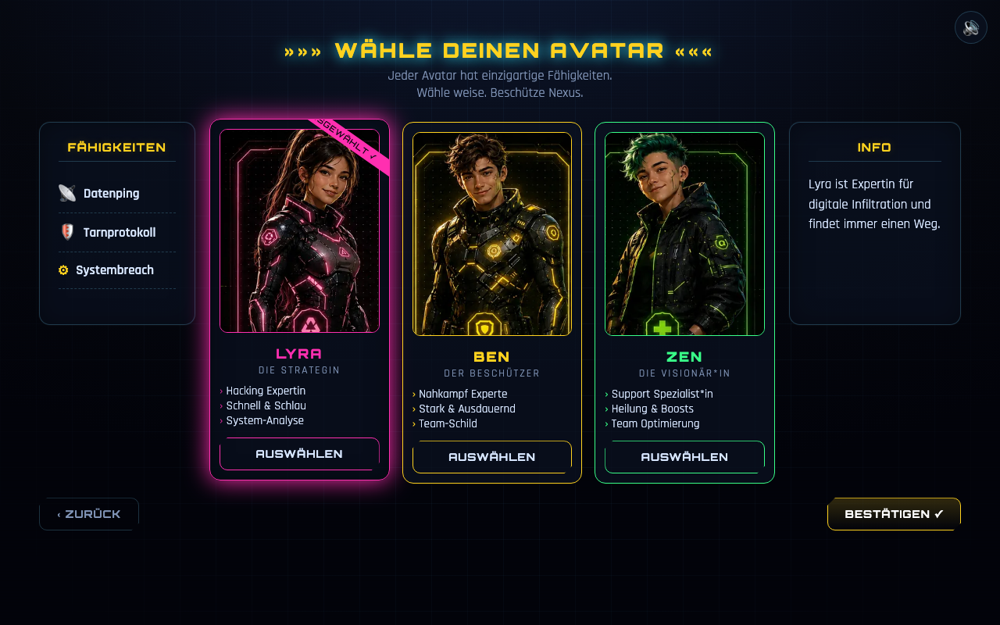

# Avatar-Auswahl

Die Spielenden wählen ihre Spielfigur. Jeder Avatar hat einen eigenen Look, eine Rolle
und Fähigkeiten.

**Design-Vorgabe (Mockup):**

**Aktueller Ist-Zustand (Umsetzung):**

---

## Zweck

Identifikation mit einer Figur; leichte Personalisierung des Spiels.

## Layout & Elemente

- **Titel:** „»»» WÄHLE DEINEN AVATAR «««“. ✅
- **Untertitel:** „Jeder Avatar hat einzigartige Fähigkeiten. Wähle weise. Beschütze Nexus.“ ✅
- **Drei Avatar-Karten** (Portrait, Lerntyp, Name, Rolle, Skill-Liste). ✅
  *(Der Button „AUSWÄHLEN" ist ab v0.12.0 entfallen – ein Klick auf die Karte genügt,
  siehe unten.)*
- **Linkes Panel „FÄHIGKEITEN“**: zeigt die Fähigkeiten des gerade betrachteten Avatars. ✅
- **Rechtes Panel „INFO“**: Kurzbeschreibung des betrachteten Avatars. ✅
- **Fußzeile:** „‹ ZURÜCK“ (zum Login) und „BESTÄTIGEN ✓“. ✅

## Avatare (Kanon aus dem Mockup)

| ID | Name | Rolle | Akzent | Skills (Mockup) |
|----|------|-------|--------|-----------------|
| `lyra` | **LYRA** | Die Strategin | Pink | Hacking Expertin · Schnell & Schlau · System-Analyse |
| `lennox`  | **LENNOX**  | Der Beschützer | Gelb | Datenschutz Experte · Stark & Ausdauernd · Team-Schild |
| `zen`  | **ZEN**  | Die Visionär*in | Grün | Support Spezialist*in · Heilung & Boosts · Team Optimierung |

**Info-Texte:**
- **Lyra:** „Lyra ist Expertin für digitale Infiltration und findet immer einen Weg.“ ✅ (aus Mockup)
- **Lennox:** „Lennox hält den Schild hoch, wenn die Firewall bricht. Nichts kommt an ihm vorbei.“ 🟡
- **Zen:** „Zen sieht Muster, wo andere nur Chaos sehen, und bringt das Team nach vorne.“ 🟡

**Fähigkeiten-Icons (Panel „FÄHIGKEITEN“):**
- Lyra: 📡 Datenping · 🛡 Tarnprotokoll · ⚙ Systembreach ✅ (aus Mockup)
- Lennox: 🛡 Schildwall · 🧱 Datenpanzer · 👁 Overwatch 🟡
- Zen: ✚ Datenheilung · 🌊 Boost-Welle · 📈 Optimierung 🟡

## Verhalten / Interaktion

- **Überfahren/Antippen** einer Karte aktualisiert die Panels „FÄHIGKEITEN“ und „INFO“ (Vorschau). 🟡
- **Klick auf die Karte** markiert sie (Glow + „AUSGEWÄHLT ✓“) und aktiviert „BESTÄTIGEN“. ✅
- **BESTÄTIGEN** speichert `avatarId` und führt weiter:
  - Erstdurchlauf (noch keine Schlüssel) → **Einleitung**.
  - Rückkehr mit Fortschritt → direkt zur **Missionskarte**. 🟡
- **ZURÜCK** → Login.

## Angenommene Entscheidungen (MVP)

- Die **Portraits** werden aus dem Mockup `avatar.png` **freigestellt** und in `media/`
  als einzelne Bilder abgelegt (`avatar-lyra/ben/zen.png`). 🟡
- Für **Lennox** und **Zen** waren im Mockup nur die Skills sichtbar; **Info-Texte und die
  Fähigkeiten-Icons wurden ergänzt** (Lyra war vollständig vorgegeben). 🟡
- Die Fähigkeiten sind im MVP **narrativ/dekorativ** und haben **keinen Spieleffekt**. 🟡

## Umsetzung im MVP

- Daten: `game/js/data/datasets.js` → `avatars`
- Markup: `game/index.html` → `section#screen-avatar`
- Style: `game/css/style.css` → Abschnitt „AVATAR screen“
- Logik: `game/js/screens.js` → `renderAvatar()`, `previewAvatar()`, `selectAvatar()`, `confirmAvatar()`

## Offene Punkte & Iterationsideen

- 💡 **Fähigkeiten mit echtem Effekt** (z. B. Lyra: ein Gratis-Tipp; Lennox: ein Fehlversuch ohne
  Abzug; Zen: kleiner Punkte-Boost) – als sanfte Differenzierung.
- 💡 Avatar-Vorschau/„Emote“-Animation wie im Mockup unten angedeutet.
- 🟡 Diversere Avatar-Auswahl / Umbenennung, falls didaktisch gewünscht.

## Avatar-Auswahl – Korrektur des Auswahl-Banners ("AUSGEWÄHLT")

### 1. Problemstellung
Bei der Auswahl des Avatars ist das diagonale Textband (Ribbon) oben rechts in der Ecke des Bildes zu schmal.
Dadurch wird das Wort **"AUSGEWÄHLT"** am Anfang abgeschnitten – die ersten beiden Buchstaben **"AU"** sind verdeckt oder fehlen vollständig.

### 2. Anweisung zur Korrektur
Die Breite des diagonalen Textbandes muss vergrößert werden, damit das gesamte Wort Platz hat.
Der Textabstand und die Schriftgröße sollen so eingestellt werden, dass das Wort **"AUSGEWÄHLT"** vollständig sichtbar, zentriert und ohne abgeschnittene Buchstaben auf dem Band liegt.

### Verbesserung mit Lerntypen

Upgrade-Anforderungen: Avatar-Auswahlbereich

## 1. Lerntyp-Kennzeichnung über den Avataren
Direkt über dem Namen jedes Avatars soll der jeweilige Verarbeitungs- bzw. Lerntyp platziert werden:

**Lyra:** Visuell
**Lennox:** Auditiv
**Zen:** Kognitiv

---

## 2. Info-Button & Erklärungs-Popups
Neben oder über der neuen Lerntyp-Bezeichnung soll ein **Info-Button** (z. B. ein ⓘ-Icon) eingefügt werden.

Beim Klicken auf diesen Info-Button soll sich ein Fenster oder eine Erklärung öffnen, welche die jeweilige Funktion beschreibt:

| Avatar | Lerntyp | Beschreibung / Erklärung |
| :--- | :--- | :--- |
| **Lyra** | **Visuell** | Die Informationen und Lerninhalte werden vorrangig grafisch und visuell aufbereitet. |
| **Lennox** | **Auditiv** | Die Informationen können angehört werden (Sprachausgabe / Audio-Funktion). |
| **Zen** | **Kognitiv** | Die Informationen werden in geschriebener Textform zum Selbstlesen bereitgestellt. |

---

## 3. Positionierung & Design
Die Beschriftung (Visuell / Auditiv / Kognitiv) steht direkt oberhalb des Avatarnamens.
Der Info-Button befindet sich rechts oder direkt neben der Lerntyp-Bezeichnung.
Das Farbschema des Info-Buttons und der Beschriftung soll sich an die jeweilige Avatar-Farbe anpassen (Pink für Lyra, Gelb für Lennox, Grün für Zen).

---

## ✅ Umsetzung v0.10.0

**Lerntyp über dem Namen.** Jede Avatar-Karte trägt zwischen Porträt und Name eine
Plakette in der Farbe des Avatars: **VISUELL** (Lyra, Pink) · **AUDITIV** (Lennox,
Gelb) · **KOGNITIV** (Zen, Grün). Daten: `game/js/data/datasets.js → avatars`,
neue Felder `learnType` und `learnInfo`.

**ⓘ-Knopf daneben.** Ein runder Knopf in derselben Farbe öffnet die Erklärung aus
der Spec-Tabelle. Er **stoppt den Klick** (`stopPropagation`) – sonst hätte das
Antippen der Erklärung nebenbei den Avatar ausgewählt, weil die ganze Karte
klickbar ist. Das Fenster nennt zusätzlich, dass der Lerntyp nur die **Darstellung**
der Info-Fenster verändert, nicht die Aufgaben oder die Punkte, und lässt sich
vorlesen.

**Band „AUSGEWÄHLT ✓" korrigiert.** Ursache des abgeschnittenen „AUS": Das 190 px
breite Band wurde um 35° gedreht, wodurch sein linkes Ende rund 54 px nach oben
schwang – bei `top: 22px` also über die obere Kartenkante, und `.avatar-card` hat
`overflow: hidden`. Das Band sitzt jetzt tiefer (`top: 40px`), etwas weiter innen
(`right: -46px`) und ist mit 200 px breiter und größer gesetzt. Das ganze Wort ist
sichtbar; ein Test prüft die Geometrie, damit es nicht zurückfällt.

### Verbesserung bei den Button Auswählen:

# Avatar-Auswahl

Wähle deinen gewünschten Avatar aus der Übersicht aus. Durch einen Klick auf das Bild markierst du ihn als aktiv. Bestätige deine Auswahl anschließend oben über den Bestätigungs-Button.

### Verfügbare Avatare

**[ Avatar 1 ]** * Beschreibung: Klickbar – wählt den Avatar direkt aus.
**[ Avatar 2 ]** * Beschreibung: Klickbar – wählt den Avatar direkt aus.
**[ Avatar 3 ]** * Beschreibung: Klickbar – wählt den Avatar direkt aus.

---
 **Hinweis:** Der separate "Auswählen"-Button wurde entfernt. Ein einfacher Klick auf den Avatar reicht nun völlig aus, um ihn zu aktivieren und den Bestätigungsprozess zu starten.
---

## ✅ Umsetzung v0.12.0 (Auswahl-Knopf entfernt)

Der separate Knopf **„AUSWÄHLEN" ist weg** – ein Klick auf die Karte wählt den Avatar
aus, genau wie in der Spec beschrieben.

**Damit die Auswahl nicht nur mit der Maus möglich bleibt**, ist die Karte selbst zum
Bedienelement geworden: `role="button"`, `tabindex="0"`, `aria-pressed` spiegelt die
Auswahl, `aria-label` nennt Name, Rolle und Lerntyp. **Enter und Leertaste** wählen aus,
ein sichtbarer Fokusring zeigt, wo man gerade steht. Neu folgen die Panels
„FÄHIGKEITEN" und „INFO" jetzt auch dem **Tastatur-Fokus** – vorher reagierten sie nur
auf die Maus.

Das war nötig, weil der entfernte Knopf bisher der **einzige** Tastaturweg zur Auswahl
war; ohne Ersatz wäre der Bildschirm ohne Maus nicht bedienbar gewesen.

Der ⓘ-Knopf für den Lerntyp behält sein `stopPropagation` und wählt weiterhin **nicht**
nebenbei den Avatar aus.
