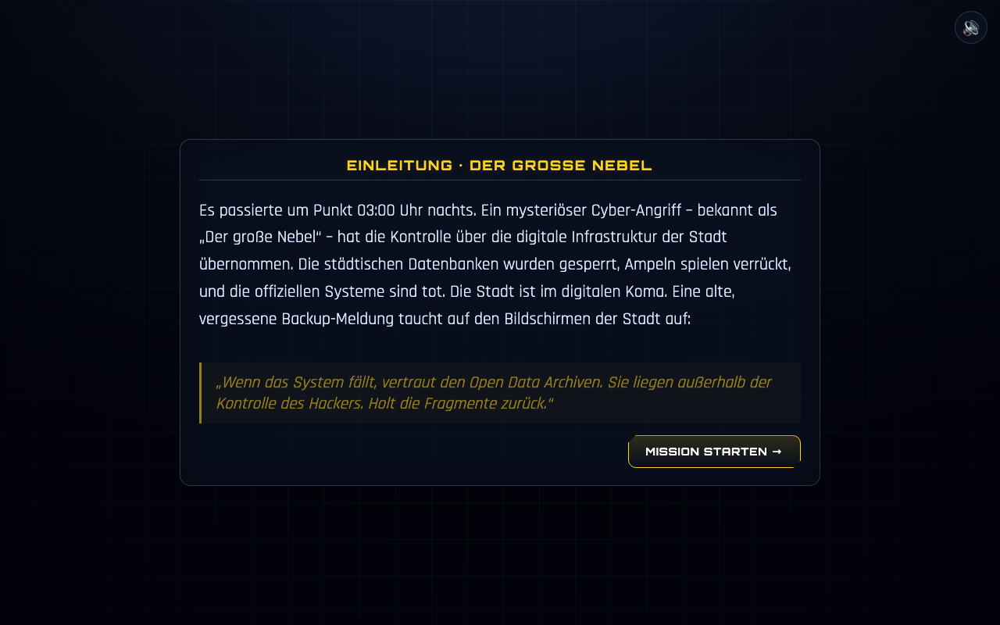

# Einleitung – „Der große Nebel“

Erzählerischer Übergang zwischen Avatar-Auswahl und Missionskarte. Führt die Story ein.

**Aktueller Ist-Zustand (Umsetzung):**

> Für diesen Bildschirm gibt es **kein separates Mockup-Bild** – die Vorlage ist der
> Story-Text aus der Präsentation *Open Data Classroom* (Folie „Der große Nebel“).

---

## Zweck

Motivation aufbauen: Warum retten wir Open Data? Der Text liefert das „Warum“ der Mission.

## Inhalt (Kanon – wörtlich) ✅

> Es passierte um Punkt 03:00 Uhr nachts. Ein mysteriöser Cyber-Angriff – bekannt als
> „Der große Nebel“ – hat die Kontrolle über die digitale Infrastruktur der Stadt
> übernommen. Die städtischen Datenbanken wurden gesperrt, Ampeln spielen verrückt, und
> die offiziellen Systeme sind tot. Die Stadt ist im digitalen Koma. Eine alte,
> vergessene Backup-Meldung taucht auf den Bildschirmen der Stadt auf:

**Hervorgehobenes Zitat:**
> „Wenn das System fällt, vertraut den Open Data Archiven. Sie liegen außerhalb der
> Kontrolle des Hackers. Hole die Fragmente zurück.“

## Layout & Elemente

- **Panel-Titel:** „EINLEITUNG · DER GROSSE NEBEL“. 🟡
- **Story-Text** mit **Schreibmaschinen-Effekt** (zeichenweise). 🟡
- **Zitat-Block** (gelb, kursiv), erscheint nach dem Text. 🟡
- **Buttons:** „Überspringen »“ (zeigt sofort den vollständigen Text) und
  „MISSION STARTEN →“ (→ Missionskarte). 🟡

## Verhalten / Interaktion

- Text tippt sich automatisch ein; danach erscheinen Zitat und „MISSION STARTEN“. 🟡
- „Überspringen“ blendet sofort den ganzen Text + Zitat + Weiter-Button ein. 🟡
- Verlässt man den Bildschirm, wird die Animation sauber gestoppt.

## Angenommene Entscheidungen (MVP)

- Der Schreibmaschinen-Effekt, der Panel-Titel und die Button-Beschriftungen sind ergänzt;
  der **Story-Text selbst ist wörtlich aus der Vorlage**. ✅/🟡
- Die Einleitung erscheint nur im **Erstdurchlauf** (danach führt „BESTÄTIGEN“ direkt zur Karte). 🟡

## Umsetzung im MVP

- Markup: `game/index.html` → `section#screen-intro`
- Style: `game/css/style.css` → Abschnitt „INTRO screen“
- Logik: `game/js/screens.js` → `startIntro()`, `finishIntro()` (Text in Konstante `INTRO_TEXT`)

## Offene Punkte & Iterationsideen

- 💡 Vertonung/Soundkulisse, Glitch-Effekte, Bild der „Backup-Meldung“.
- 💡 Kurze Zwischentexte **vor jedem Level** (die PDF liefert diese bereits, z. B.
  „Die lautlosen Boten“, „Das Labyrinth der Lügen“, „Licht aus der Dunkelheit“) –
  siehe jeweilige Level-Spec.
- 🟡 Einleitung optional erneut abrufbar (z. B. Button „Story nochmal ansehen“).

### Verbesserung von der Einleitung:

Der Inhalt also die luvvoice.com-20260805-MomwB7, welches unter story/audio gespeichert wurde soll unabhängig vom Avatar laut vorgelesen werden.

## Inhalt (Kanon – wörtlich) ✅

> Es passierte um Punkt 03:00 Uhr nachts. Ein mysteriöser Cyber-Angriff – bekannt als
> „Der große Nebel“ – hat die Kontrolle über die digitale Infrastruktur der Stadt
> übernommen. Die städtischen Datenbanken wurden gesperrt, Ampeln spielen verrückt, und
> die offiziellen Systeme sind tot. Die Stadt ist im digitalen Koma. Eine alte,
> vergessene Backup-Meldung taucht auf den Bildschirmen der Stadt auf:

**Hervorgehobenes Zitat:**
> „Wenn das System fällt, vertraut den Open Data Archiven. Sie liegen außerhalb der
> Kontrolle des Hackers. Hole die Fragmente zurück.“

---

## ✅ Umsetzung v0.12.0 (Vertonung)

Die gelieferte Aufnahme `story/audio/luvvoice.com-20260805-MomwB7.mp3` (35 s) vertont
diesen Einleitungstext. Sie liegt im Spiel als **`game/media/einleitung.mp3`** und ist
in `game/js/data/voice.js` unter dem Schlüssel `intro` eingetragen.

* Sie startet **automatisch**, sobald der Einleitungs-Bildschirm erscheint – **unabhängig
  vom gewählten Avatar**. Bis dahin wurde mehrfach geklickt (Start → Login → Avatar →
  Bestätigen), die Tonfreigabe des Browsers liegt also vor.
* Ein sichtbarer Knopf **„⏹ Vorlesen stoppen"** bzw. **„🔊 Nochmal vorlesen"** steht
  neben „Überspringen »".
* Der Schreibmaschinen-Effekt (~7 s) und die Aufnahme (35 s) laufen **parallel**: Der
  Text steht vollständig da, während weitergesprochen wird. Lesen und Hören bremsen
  sich nicht gegenseitig aus.
* Bildschirmwechsel, Stummschaltung und eine fehlende Datei beenden die Ausgabe
  jeweils sauber; der Knopf bleibt dann aus und die Einleitung läuft trotzdem.

> **Abgrenzung:** Das ist die **einzige** feste Aufnahme im Spiel. Der Knopf
> **VORLESEN** in Tipps und Info-Fenstern nutzt seit v0.12.0 ausnahmslos die
> Browser-Stimme – siehe [stimme.md](stimme.md).
