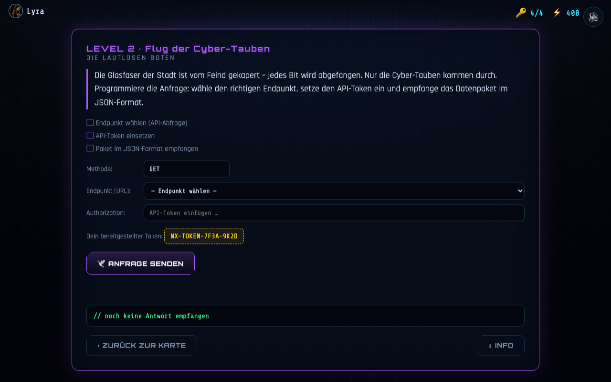

# Level 2 – Flug der Cyber-Tauben

**Untertitel:** Die lautlosen Boten · **Akzent:** Violett · **Lernfokus:** API-Abfrage, API-Token, JSON

**Aktueller Ist-Zustand (Umsetzung):**

> Vorlage: PDF-Folien „Die lautlosen Boten“ (Story) und „Level 2: Flug der Cyber-Tauben“ (Aufgabe).

---

## Story (Vorlage) ✅

> Die Glasfaserkabel der Stadt ist vom Hacker besetzt. Jedes Bit, das wir senden, wird
> abgefangen. Es gibt nur einen Weg vorbei an der Firewall: Die Cyber-Tauben. Diese
> mechanischen Boten fliegen über die Funklöcher hinweg. Du musst sie programmieren,
> damit sie die Rettungspakete direkt ins Herz der Stadtverwaltung tragen.

## Lernziel

Verstehen, wie man Daten über eine **API** abfragt: **Endpunkt** wählen, **API-Token**
einsetzen, Antwort als **JSON** empfangen.

## Aufgaben (Checkliste) ✅ (aus der Vorlage)

1. Boten programmieren (API-Abfrage)
2. API-Token nutzen
3. Paket empfangen im JSON-Format

## MVP-Aufgabe (umgesetzt) 🟡

Ein **API-Request-Builder**:

- **Methode:** GET (fest). **Endpunkt:** Dropdown mit einer korrekten und zwei falschen/unsicheren URLs.
- **Authorization:** der bereitgestellte **API-Token** muss eingesetzt werden.
- **„🕊 Anfrage senden“** startet eine **simulierte** Abfrage (Tauben-Flug-Animation):
  - falscher Endpunkt → `404`, unsicher/verdächtig.
  - fehlender/falscher Token → `401 Unauthorized`.
  - korrekt → `200` + **JSON-Datenpaket** (syntaxhervorgehoben).
- Läuft **offline** (kein echter Netzwerkaufruf – Antwort ist eingebettet).

### Beispieldaten (`NX.data.level2`)

- Gültiger Endpunkt: `https://opendata.nexus.city/v1/luftqualitaet`
- Gültiger Token: `NX-TOKEN-7F3A-9K2D`
- Antwort (200): Luftqualität (PM10 je Bezirk), inkl. `lizenz: CC-BY 4.0`, `aktualisiert`, `einheit`.

## Punkte 🟡

`100 − (Fehlversuche × 15)`, Untergrenze **50**.

## Info-Popup (ℹ) 🟡

Erklärt **API**, **API-Token** (Fehler 401 ohne gültigen Token) und **JSON** (Schlüssel:Wert-Paare).

## Angenommene Entscheidungen (MVP)

- **Simulierte** API (keine echte Verbindung), damit das Level offline und stabil läuft. 🟡
- Konkreter Endpunkt/Token/JSON als Beispiel; Fehlercodes 401/404 als Lernmoment. 🟡

## Umsetzung im MVP

- Logik: `game/js/levels/level2.js` · Daten: `game/js/data/datasets.js` → `level2`

## Iterationsideen 💡

- Optionaler Abruf **echter** Open-Data-APIs (online), inkl. Rate-Limit/Token-Handling.
- Query-Parameter zusammenbauen (Filter/Bezirk), Antwort abhängig von Parametern.
- JSON-Felder gezielt auslesen lassen („Welcher Bezirk hat PM10 = 57?“).
- Mehrere Tauben/Pakete, Reihenfolge/Timing als kleines Geschicklichkeitselement.

## Flug der Cyber-Tauben – Anforderung & Ablauf

Dieses Dokument beschreibt die Interaktions-Mechanik und den visuellen Ablauf für **Level 2 ("Flug der Cyber-Tauben")**.

## 1. Bildreferenzen / Design-Vorgaben
**Design der Cyber-Taube:**
  * Als visuelle Vorlage dient die Datei Cybertaube.png.
  * Das Aussehen der Taube im Spiel soll sich **exakt nach diesem Bild** richten.
  

**Design der Pergamentrolle:**
  * Als visuelle Vorlage für die Nachricht im Schnabel dient die Datei Pergamentrolle.png.
  * Die Darstellung der Rolle sowie die spätere Entfaltungs-Animation basieren auf dieser Grafik.
  

## 2. Anflug der Taube
Eine sehr große Cyber-Taube (Cybertaube.png) fliegt von **rechts nach links** über den Bildschirm.
Die Taube bedeckt dabei den Bildschirm kurzzeitig großflächig, um volle Aufmerksamkeit zu erzeugen.

## 3. Landung & Interaktion
Die Taube landet zentriert in der **Mitte des Bildschirms**.
Sie hält eine Nachricht in Form der Pergamentrolle (Pergamentrolle.png) im Schnabel.
Der Spieler muss auf die Taube bzw. die Pergamentrolle **klicken**, um fortzufahren.

## 4. Wegflug & Token-Reveal
Sobald der Klick erfolgt:
  * Die Taube fliegt wieder vom Bildschirm weg.
  * Die Pergamentrolle (Pergamentrolle.png) öffnet sich zentriert in der Mitte des Bildschirms.
  * Auf der geöffneten Pergamentrolle wird der **API-Token** sichtbar angezeigt.

## 5. Token-Übertragung
Der angezeigte API-Code fliegt animiert von der Pergamentrolle direkt auf den dafür vorgesehenen Button mit dem bereitgestellten Token (gelbes Feld).
Der Token wird dort automatisch eingetragen.