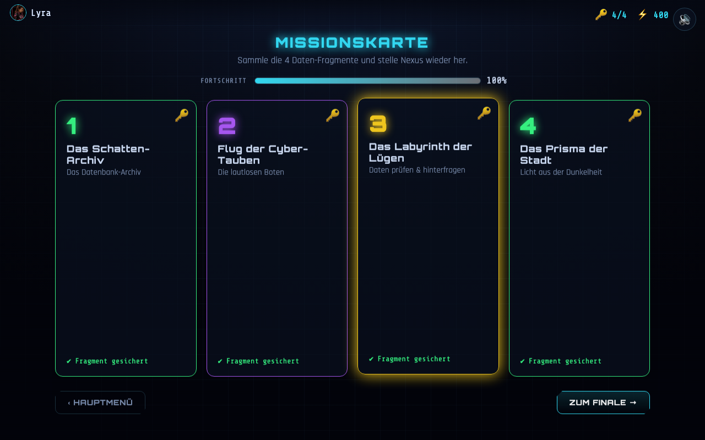

# Missionskarte

Die zentrale Übersicht (Hub) zwischen den Levels. Zeigt Fortschritt und schaltet Levels frei.

**Aktueller Ist-Zustand (Umsetzung):**

> Kein eigenes Mockup – abgeleitet aus dem Spielablauf (4 Levels + Fortschritt).

---

## Zweck

Orientierung geben, Fortschritt sichtbar machen, Level starten.

## Layout & Elemente

- **Titel:** „MISSIONSKARTE“ + Untertitel „Sammle die 4 Daten-Fragmente und stelle Nexus wieder her.“ 🟡
- **Fortschritts-Balken** „FORTSCHRITT“ (abgeschlossene Levels / 4, in %). 🟡
- **Vier Level-Kacheln** (Nummer, Titel, Untertitel, Status, Akzentfarbe des Levels). 🟡
- **HUD** oben: Avatar-Chip, `🔑 X/4`, `⚡ Punkte`. 🟡
- **Fußzeile:** „‹ Hauptmenü“ und (wenn alles gelöst) „ZUM FINALE →“. 🟡

## Kachel-Status

| Status | Darstellung | Klickbar? |
|---|---|---|
| **abgeschlossen** | Rahmen doppelt, Badge 🔑, „✔ Fragment gesichert“ | ja (erneut spielbar) |
| **bereit** (offen) | volle Akzentfarbe, Badge 🔓, „▶ bereit“ | ja |
| **gesperrt** | ausgegraut, Badge 🔒, „🔒 gesperrt“ | nein (Hinweis-Toast) |

## Verhalten / Interaktion

- **Freischaltung:** Level *n* ist „bereit“, sobald Level *n‑1* abgeschlossen ist; Level 1 immer offen. ✅
- Klick auf offene/abgeschlossene Kachel → Level öffnet sich (Level-Host).
- Klick auf gesperrte Kachel → Toast „Schließe zuerst das vorige Level ab.“ 🟡
- **Alle Levels abgeschlossen** → Button „ZUM FINALE →“ erscheint (→ Belohnung). ✅
- **Hauptmenü** → Startseite.

## Angenommene Entscheidungen (MVP)

- Kachel-Optik, Status-Texte, Badges und die Fortschrittsanzeige sind eine ergänzte,
  aber naheliegende Umsetzung des Ablaufs. 🟡
- Titel/Untertitel der Levels stammen aus der Präsentation. ✅

## Umsetzung im MVP

- Markup: `game/index.html` → `section#screen-map`
- Style: `game/css/style.css` → Abschnitt „MAP screen“
- Logik: `game/js/screens.js` → `renderMap()`; Freischaltung in `game/js/levels/registry.js`

## Offene Punkte & Iterationsideen

- 💡 „Karte“ visuell als Stadtplan/Netzwerk mit Verbindungslinien statt reiner Kacheln.
- 💡 Pro Kachel Bestleistung/Sterne anzeigen; „Neuer Rekord“-Feedback.
- 💡 Optionaler nicht-linearer Zugang (mehrere Levels gleichzeitig offen).

## Anpassungen Missionskarte (Level-Auswahl)

## 1. Avatar-Platzierung & Layout
**Avatar-Position:**
  * Der aktuell gewählte Avatar befindet sich **links neben der gesamten Missionskarte** (außerhalb der einzelnen Kacheln).
  * Innerhalb der vier Kacheln wird kein Avatar angezeigt.
**Freiraum innerhalb der Kacheln verkleinern / nutzen:**
  * Der unnötige Leerraum innerhalb der einzelnen Missionskacheln soll verringert bzw. optimal genutzt werden.
  * Das Design der Kacheln soll kompakter wirken, ohne die Lesbarkeit zu beeinträchtigen.
**Lesbarkeit gewährleisten:**
  * Sämtliche Texte und Inhalte auf den Kacheln müssen weiterhin gut und klar lesbar sein.

## 2. Typografie & Farbschema
**Unterüberschriften anpassen:**
  * Die Schriftgröße der Unterüberschriften in den Kacheln wird vergrößert.
  * Die Farbe der jeweiligen Unterüberschrift orientiert sich exakt am Farbschema der entsprechenden Kachel:
    * **Kachel 1 (Das Schatten-Archiv):** Grün
    * **Kachel 2 (Flug der Cyber-Tauben):** Lila
    * **Kachel 3 (Das Labyrinth der Lügen):** Gelb
    * **Kachel 4 (Das Prisma der Stadt):** Grün / Cyan

## 3. Buttons & Statusanzeige
**Textänderung:**
  * Der Text neben dem Dreieck-Symbol wird von bereit auf **Start** geändert.
**Sichtbarkeit:**
  * Der Button bzw. die Statusanzeige muss gut und deutlich sichtbar gestaltet sein.
