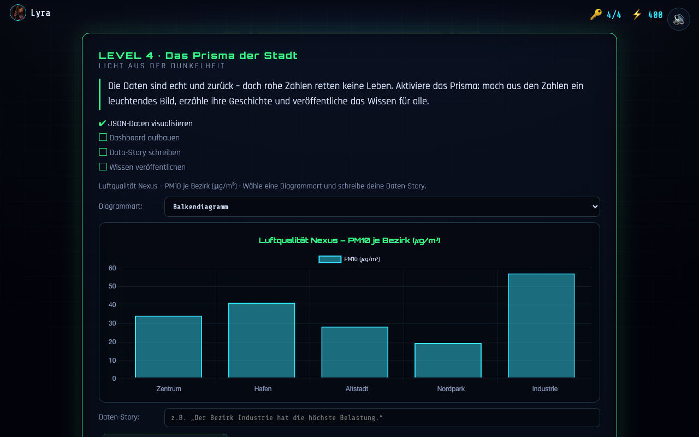

# Level 4 – Das Prisma der Stadt

**Untertitel:** Das Bürger-Portal & die lebendige Cyber-Stadt · **Akzent:** Neon-Blau (#00BFFF) · **Lernfokus:** Diagrammtypen, Drag & Drop, Open Data vs. DSGVO

> **Hinweis:** Die frühere Fassung nannte hier „Licht aus der Dunkelheit / Akzent Grün“.
> Ab **v0.7.0** gilt der Abschnitt „Die Daten-Metropole“ weiter unten: Neon-Blau (#00BFFF).

**Aktueller Ist-Zustand (Umsetzung):**

> Vorlage: PDF-Folien „Licht aus der Dunkelheit“ (Story) und „Level 4: Das Prisma der Stadt“ (Aufgabe).

---

## Story (Vorlage) ✅

> Die Daten sind wahr. Die Boten sind zurückgekehrt. Doch rohe Zahlen retten keine Leben.
> Die Menschen brauchen Klarheit. Wir aktivieren das „Prisma“. Es bündelt die trockenen
> Zeilen Code und verwandelt sie in leuchtende Landkarten und Diagramme. Das Wissen wird
> für alle sichtbar.

## Aufgaben (Checkliste) ✅ (aus der Vorlage)

1. Datenkompetenz
2. Wahl des richtigen Diagrammtyps
3. Interaktive Anwendung
4. Medienkompetenz
5. Eigenverantwortung

# Level 4 – Die Daten-Metropole (Diagramm-Auswahl, Drag-and-Drop & Info-System)

**Untertitel:** Das Bürger-Portal, Daten-Visualisierung und das Info-Glossar
**Primärfarbe (Hauptfarbe):** Neon-Blau (#00BFFF / Electric Blue)
**Lernfokus:** Datensätze verstehen, den richtigen Diagrammtyp auswählen, per Drag & Drop visualisieren und theoretisches Wissen fehlerfrei anwenden.

---

## 1. Die strikte Trennung: Info-Button vs. Tipp-Button

Um das Spiel fair und lehrreich zu gestalten, sind die Hilfen klar getrennt:
**Der Info-Button (Das Diagramm-Glossar):** * **Kosten:** **0 Punkte** (absolut straffrei).
  * **Inhalt:** Erklärt rein die Theorie, welcher Diagrammtyp (Säule, Linie, Kreis) für welche Daten gedacht ist. Enthält **keinerlei** Tipps zur aktuellen Level-Aufgabe oder Lösungshinweise! 
  * **Der Clou:** Wer das Glossar liest und die kurze Avatar-Frage am Ende richtig beantwortet, sammelt extra Bonuspunkte.
**Der Tipp-Button (Notfall-Hilfe):** * **Kosten:** **Minuspunkte** – umgesetzt sind einheitlich **−10 Punkte** je Tipp (zentral im Level-Host, siehe [../info.md](../info.md)).
  * **Inhalt:** Der einzige Ort, an dem konkrete Hinweise zur aktuellen Zuordnung im Level gegeben werden.

---

## 2. Avatar-spezifisches Info-Glossar (Level 4 Theorie)

Je nach gewähltem Avatar präsentiert sich die Erklärung der Diagrammtypen im Info-Button völlig unterschiedlich:

### 👩‍💻 Lyra – Der visuelle Lerntyp
**Darstellung:** Holografische Symbol-Übersichten.
**Inhalt:** Visuelle Faustregeln (Linie für Zeit/Verlauf, Säulen für Kategorienvergleiche, Kreis für geteilte Anteile).

### 🎧 Lennox – Der auditive Lerntyp
**Darstellung:** Ein blauer Audio-Funkkanal.
**Inhalt:** Anschauliche Erklärungen und Vergleiche aus dem Alltag, warum man bestimmte Diagramme für bestimmte Daten braucht.

### 🧠 Zen – Der kognitive / textbasierte Lerntyp
**Darstellung:** Ein strukturiertes Hacker-Terminal mit klaren Definitionen:
  * **Liniendiagramm:** Ideal für zeitliche Verläufe und kontinuierliche Datenreihen.
  * **Säulendiagramm:** Ideal für den direkten Mengenvergleich diskreter Kategorien.
  * **Kreisdiagramm:** Ideal zur Darstellung von Prozent-Anteilen an einem geschlossenen Ganzen (100 %).

---

## 3. Die Gameplay-Mechanik: Auswahl & Drag-and-Drop in Level 4

Auf dem zentralen blauen Bürger-Dashboard müssen die Spieler die rohen Datensätze für die Bürger aufbereiten. Das geschieht in **zwei Schritten**:

### Schritt 1: Der Verständnis-Check (Auswahl)
Der Spieler überlegt (oder schaut im Info-Glossar nach), welches Diagramm für die Bürger am leichtesten verständlich ist, und wählt den Typ aus.

### Schritt 2: Die Aktivierung (Drag & Drop)
Nach der richtigen Auswahl zieht der Spieler den Daten-Chip mit der Maus in das entsprechende Ziel-Feld.

---

## 4. Die Level-Aufgaben im Detail

### 📈 Aufgabe 1: Der Atem der Stadt (Feinstaubverlauf über 24 Stunden)
**Wahl:** **Liniendiagramm** ➔ **Drag & Drop** in das Liniendiagramm-Feld.
**Erfolg & Feedback:** Die blaue Kurve baut sich auf. Die Bürger-KI meldet: „Perfekt! Die Bürger sehen auf einen Blick, wann die Luft am schlechtesten war.“

### 📊 Aufgabe 2: Der Müll-Check (Vergleich der 5 Stadtteile)
**Wahl:** **Säulendiagramm** ➔ **Drag & Drop** in das Säulendiagramm-Feld.
**Erfolg & Feedback:** Die blauen Säulen schießen nach oben. Die Bürger-KI meldet: „Sehr gut! So sehen alle sofort, welcher Stadtteil den meisten Müll produziert.“

### 🥧 Aufgabe 3: Der Stadt-Kuchen (Budget-Aufteilung in 100 %)
**Wahl:** **Kreisdiagramm** ➔ **Drag & Drop** in das Kreisdiagramm-Feld.
**Erfolg & Feedback:** Der Kreis teilt sich in blaue Segmente auf. Die Bürger-KI meldet: „Genau richtig! Das versteht wirklich jeder Bürger sofort.“

---

## 5. Fehler-Handling (Falsches Ziehen oder falsche Auswahl)
**Reaktion:** Versucht der Spieler, unpassende Diagramme zuzuordnen, prallt der Chip mit einem blauen Glitch-Effekt ab. 
**Hinweis:** Die KI gibt einen kurzen Tipp: „Falsches Werkzeug! Überlege, was für die Bürger am leichtesten zu lesen ist.“ (Wer absolut festhängt, kann den kostenpflichtigen Tipp-Button nutzen).

Nach gelösten Level 4 : Die lebendige Cyber-Stadt (360°-Erkundungs-Modul)

**Untertitel:** Interaktive Open-Data- & Datenschutz-Erkundung im urbanen Grünraum
**Primärfarbe (Hauptfarbe):** Neon-Blau (#00BFFF / Electric Blue)
**Lernfokus:** Visuelle Unterscheidung zwischen offenen Daten (Open Data) und streng privatem Datenschutz (DSGVO) in einer lebendigen, modernen Parklandschaft.

---

## 1. Detaillierte Umgebungs- und KI-Beschreibung (Die Cyber-Stadt)

**Die Kulisse:** Eine hochmoderne, wunderschöne und klimafreundliche Metropole, in der High-Tech und Natur perfekt verschmelzen. 
**Grünflächen & Natur:** Überall gibt es sattgrüne Wiesen, blühende Blumenbeete und vertikale Gärten an den futuristischen Gebäuden. Kleine, animierte **Bienen** summen von Blüte zu Blüte, und **Vögel** fliegen zwischen den Baumkronen hindurch, um eine lebendige, naturnahe Atmosphäre zu erzeugen.
**Das Stadtleben:** Auf den breiten Fußgängerwegen und in den Parkanlagen wuseln freundliche, animierte Bürger umher, die ihren alltäglichen Aktivitäten nachgehen.
**Die 360°-Rundumsicht & Avatar-Steuerung:** In der Mitte der Szene steht der vom Spieler ausgewählte Avatar (**Lyra**, **Lennox** oder **Zen**) als detailreicher 2D-Sprite. Mithilfe der Maus dreht sich die Kamera flüssig um 360 Grad im Kreis, sodass die Schüler die gesamte Umgebung rundherum erkunden und auf interaktive Hotspots klicken können.

---

## 2. Die 10 Stadt-Szenarien im Detail (5x Open Data / 5x Privat)

### 🟢 Gruppe A: Perfekt für Open Data (Freigeben)
1. **Die Jogger im Park (Schrittzähler-Mittelwerte):** Anonymisierte Fitness-Statistiken von Sportlern helfen der Stadtverwaltung dabei, Laufstrecken und Parks optimal zu planen.
2. **Die Luftgüte-Station an der Kreuzung:** Ein futuristischer Sensor an einem Baum zeigt live die Feinstaubwerte für den Umweltschutz an.
3. **Der Live-Fahrplan an der Bushaltestelle:** Digitale Echtzeitdaten, die den Bürgerinnen und Bürgern die genaue Ankunftszeit der Busse anzeigen.
4. **Die freien Parkplätze in der Tiefgarage:** Live-Anzeigen, die den Parksuchverkehr reduzieren und so die Umweltbelastung in der Stadt senken.
5. **Der öffentliche Stadtplan:** Digitale Terminals, die barrierefreie Wege, öffentliche Trinkbrunnen und Sitzbänke für alle verzeichnen.

### 🔴 Gruppe B: Streng Privat / Tabu (Sperren)
6. **Die Kundin beim Bezahlen im Café:** Eine Person zahlt an der Kasse; auf einem Hologramm blinken Kontostand, IBAN und Einkäufe auf (Unterliegt streng der DSGVO).
7. **Das Smartphone mit privatem Chat auf der Parkbank:** Ein liegengebliebenes Gerät zeigt im Vorschaufenster persönliche Nachrichten und private Gespräche.
8. **Die Überwachungskamera am Wohneingang:** Eine Live-Kamera filmt das Gesicht einer Privatperson beim Betreten ihres Hauses (Verletzt die Privatsphäre).
9. **Die offene Krankenakte im Wartezimmer:** Ein herumliegender Aktenordner zeigt Namen und medizinische Diagnosen eines Bürgers (Extrem schützenswerte Gesundheitsdaten).
10. **Der digitale Haustür-Code / Smart-Home:** Ein Display an einer Wohnungsfassade zeigt den Zugangscode und die Steuerung der privaten Immobilie (Sicherheitsrisiko).

---

## 3. Spielerisches Feedback & Abschluss
**Richtiger Klick (z. B. auf Jogger oder Luft-Sensor):** Der Avatar freut sich, das Objekt leuchtet in hellem Neon-Blau auf, und die Bürger-KI erklärt den konkreten Nutzen für die Allgemeinheit.
**Falscher Klick (z. B. auf private Bankdaten oder Chatverläufe):** Ein roter Glitch erscheint auf dem Bildschirm; die Bürger-KI warnt sofort vor einem schweren Datenschutzverstoß (DSGVO) und fordert zum Sperren auf.
**Finalerfolg:** Wer alle 10 Szenarien in der 360°-Umgebung korrekt zugeordnet hat, schaltet den **„Open-Data-Hero-Award“** frei und führt die begrünte Cyber-Stadt erfolgreich in eine sichere und transparente Zukunft! 

###  Großes Finale: Der Triumph der Open-Data-Metropole

**Untertitel:** Die feierliche Eröffnung des Bürger-Portals & Verleihung des Open-Data-Hero-Awards
**Primärfarbe (Hauptfarbe):** Neon-Blau (#00BFFF / Electric Blue)
**Lernfokus:** Reflektion des gesamten Spielerfolgs, Zusammenführung von Transparenz und Datenschutz, epischer Abschluss des Spiels.

---

## 1. Die finale Szenerie: Das erwachte Rathaus & die glückliche Stadt

Nachdem alle vier Level erfolgreich gemeistert, die Daten bereinigt, die Diagramme richtig zugeordnet und die 360°-Umgebung auf Open Data und Datenschutz geprüft wurde, verändert sich die gesamte Spielwelt grundlegend:
**Der visuelle Wandel:** Die zuvor graue, krisengeschüttelte Cyber-Stadt erstrahlt in einem atemberaubenden, hellen **Neon-Blau (#00BFFF)**. 
**Leben auf den Straßen:** Überall im begrünten Park und vor dem Rathaus feiern animierte Bürger und die zuvor entdeckten Jogger, Radfahrer und Passanten das neue, transparente Zeitalter. Bienen summen, Vögel fliegen und über den Plätzen schweben gigantische, holografische Willkommens-Banner.

---

## 2. Die Abschluss-Zeremonie (Das große Dashboard-Finale)

Der gewählte Avatar (**Lyra**, **Lennox** oder **Zen**) betritt feierlich die Hauptbühne vor dem virtuellen Rathaus. 
**Die Ansprache der Bürger-KI:** Das System schaltet sich ein und fasst die Leistung der Spieler zusammen:
  > „Agent! Du hast die Stadt aus dem digitalen Koma gerettet. Du hast rohes Datenchaos in klare, verständliche Einsichten verwandelt, die Gesetze des Datenschutzes gewahrt und die Verwaltung transparent gemacht!“
**Die Statistik-Zusammenfassung (Der Erfolg):** Ein cooles, blaues Hologramm-Zertifikat ploppt auf und zeigt dem Schüler eine Übersicht seiner Heldentaten:
  * 📡 **Level 1:** APIs & JSON – Daten sicher abgeholt
  * 🗄️ **Level 2:** Open Data verstanden & Fälschungen korrigiert
  * 🔍 **Level 3:** Quellen geprüft – Lügen entlarvt
  * 📊 **Level 4:** Diagramme korrekt gewählt & 360°-Datenschutz-Check gemeistert

> **Korrigierte Zuordnung (ab v0.7.0):** Die ursprüngliche Liste nannte noch die Reihenfolge
> vor v0.5.0 (L1 Open Data / L2 APIs). Seit dem Tausch von Level 1 und 2 ist
> L1 = Cyber-Tauben (API/JSON), L2 = Schattenarchiv (Open Data),
> L3 = Labyrinth der Lügen (Quellenprüfung).

---

## 3. Die Belohnung: Der „Open-Data-Hero-Award“

Als episches Finale wird dem Avatar die höchste Auszeichnung der Metropole verliehen:
**Der Award:** Ein leuchtender, rotierender Cyber-Pokal aus purem Neon-Blau, der sich in der Luft dreht.
**Das digitale Badge:** Die Schüler erhalten das offizielle Abzeichen **„Open-Data-Hero & Datenschutz-Experte“** für ihr Profil, das sie stolz speichern oder teilen können.

---

## 4. Der emotionale Schlusssatz & Ausblick

Zum Abschied öffnet sich das voll funktionsfähige Bürger-Portal, durch das die virtuellen Bürger nun friedlich, informiert und sicher in die Zukunft blicken. 
**Der letzte Satz im Spiel:** „Transparenz schafft Vertrauen – und du hast gezeigt, wie eine smarte Stadt von morgen aussieht!“

# Verbesserung 

## 1. Problemstellung & Optimierungsbedarfe

### Usability & Lesbarkeit
**Zu kleine Handlungsanweisungen:** Der zentral wichtige Hinweis „Ziehe den Chip ins leuchtende Feld – oder klicke ihn an.“ ist im bisherigen UI zu klein und dünn dargestellt. Er geht optisch zwischen den umliegenden Buttons und Kontrollelementen unter.
**Fehlende Benutzerführung:** Nutzer übersehen häufig den aktuellen Zustand, in dem ein Diagrammtyp ausgewählt ist und der Datenchip (z. B. Feinstaub-Messreihe) verschoben oder angeklickt werden muss.

### Visuelles Setting & Atmosphäre
**Tageslicht-Modus statt Nachtkulisse:** Die 360°-Stadtansicht ist derzeit zu dunkel. Für eine signifikant bessere Lesbarkeit, eine freundlichere Optik und geringere visuelle Ermüdung wird die Cyber-Stadt auf ein **helles Tageslicht-Setting** umgestellt.

### Gameplay & Interaktionsfluss
**Direkt-Klick statt Avatar-Laufwegen:** Im 360°-Erkundungsmodus muss der Avatar **nicht** mehr physisch zum Datenpunkt laufen. Ein direkter Klick auf ein Objekt oder Icon öffnet **sofort** den zugehörigen Entscheidungs-Dialog – unabhängig von der aktuellen Position des Avatars.

### Barrierefreiheit (Accessibility) & Status-Visualisierung
**Symbol-Ergänzung für Buttons:** Die Entscheidungs-Buttons erhalten eindeutige Icons (Haken / Kreuz), um Farbfehlsichtigkeiten optimal zu unterstützen (das bewährte Grün/Blau-Farbschema bleibt erhalten).
**Visueller „Erledigt“-Zustand:** Bereits geprüfte Datenpunkte im 360°-Panorama werden klar als abgehakt bzw. deaktiviert gekennzeichnet.

---

## 2. Visuelle Überarbeitung: Tag-Modus für die Stadt (360°-Ansicht)

### 2.1 Visual Design Requirements
**Hintergrund & Beleuchtung:**
  * Vollständiger Wechsel von der nächtlichen Cyber-Optik zu einer **hellen Tagansicht**.
  * Die Skyline, der Himmel und die Gebäudefronten sind gut ausgeleuchtet und in klaren, hellen Tönen gehalten.
**Kontrast & Lesbarkeit:**
  * Interaktive Icons und Buttons (z. B. Umweltsensor, Privater Chat) heben sich durch deutliche Konturen, Schlagschatten oder dunklere Ränder prägnant vom hellen Hintergrund ab.

---

## 3. Anforderungen an Hinweistexte & UI-Banner

### 3.1 Instruktions-Banner (Zentral)
**Typografie:** Schriftgröße erhöht auf **1.1rem bis 1.25rem**, fett gedruckt (font-weight: bold), optisch deutlich hervorgehoben.
**UI-Container:** Platzierung in einem eigenen, farblich akzentuierten Badge/Banner (abgerundete Ecken, dezenter Glow-Effekt passend zum Sci-Fi-Stil).
**Dynamischer Status-Text:**
  * **Status 1 (Vor Auswahl):** „Wähle zuerst den passenden Diagrammtyp aus.“
  * **Status 2 (Nach Auswahl):** „Ziehe den Chip 'Feinstaub-Messreihe' ins leuchtende Feld oder klicke ihn an!“

---

## 4. UI-Komponenten & Interaktionsablauf

### Phase A: Diagrammwahl & Chip-Zuordnung (Aufgabe 1/3)

1. **Szenario:** Der Atem der Stadt – Feinstaub (PM10) über 24 Stunden (fortlaufende Zeitreihe).
2. **Diagramm-Auswahl:**
   * [x] **Liniendiagramm** (Korrekt für Zeitreihenverläufe)
   * [ ] Säulendiagramm
   * [ ] Kreisdiagramm
3. **Dropzone & Target-Verhalten:**
   * Nach Auswahl des Liniendiagramms leuchtet die Ziel-Dropzone visuell auf.
   * Der Datenchip **[ Feinstaub-Messreihe ]** wird aktiv geschaltet und lässt sich per Drag-and-Drop oder einfachem Klick zuweisen.

---

### Phase B: 360°-Erkundung – Direct-Click & Entscheidungs-Overlay

Nach erfolgreicher Dashboard-Befüllung wechselt das System nahtlos in die **helle 360°-Stadtansicht**.

#### Aufgabenstellung & UI-Formulierung
 **Erkunden & Entscheiden:** Drehe dich nur mit der Maus um 360° und klicke einen leuchtenden Datenpunkt direkt an.
 Entscheide für jeden Datenpunkt: Darf er als **offene Daten (FREIGEBEN)** bereitgestellt werden oder muss er als **private Daten (SPERREN)** geschützt bleiben?

#### Interaktions-Logik & UX-Spezifikation

| Bereich | Spezifikation & Verhalten |
| :--- | :--- |
| **Direct-Click** | Klick auf ein beliebiges leuchtendes Icon öffnet unmittelbar das Entscheidungs-Modal (keine Avatar-Laufzeit). |
| **Accessibility Buttons** | **[ ✓ FREIGEBEN ]** – Grünes UI-Element mit sichtbarem Häkchen-Symbol. **[ ✖ SPERREN ]** – Blaues/Dunkles UI-Element mit sichtbarem X-Symbol. |
| **Erledigt-Status** | Bereits entschiedene Punkte wechseln im 360°-Panorama in einen ausgegrauten Zustand mit grünem Haken-Badge. Bei Hover/Klick erscheint: „Bereits entschieden“. |
| **Touch & Mobile UX** | Klickbare Punkte im 360°-Raum besitzen eine unsichtbare Trefferfläche von mindestens **44 × 44 Pixel**. |

---

## 5. Feature-Spezifikation: Leaderboard & Ranking-System (Automatischer Login)

### 5.1 Übersicht & Zielsetzung
Um den Ablauf für Schülerinnen und Schüler so einfach wie möglich zu gestalten, erfolgt die Eingabe von **Name / Nickname** und **Klassencode** einmalig **vor dem Start des Spiels**. Die gesammelten Punkte werden während des Spiels (inkl. Level 4) automatisch im Hintergrund erfasst. Am Ende des Spiels wird direkt die Bestenliste (Leaderboard) angezeigt, ohne dass erneut Daten eingegeben werden müssen.

### 5.2 Ablauf & Session-Handling (UX-Flow)
**Schritt 1:** Spiel-Start aufrufen
**Schritt 2:** Eingabe von Name + Klassencode
**Schritt 3:** Spielverlauf durchspielen & Punkte im Hintergrund sammeln
**Schritt 4:** Spiel-Ende mit automatischer Anzeige des Klassen-Rankings

#### Detailbeschreibung:
1. **Spielstart (Onboarding):**
   * Nach dem Klick auf „Spiel starten“ öffnet sich das Eingabefenster.
   * **Pflichtfelder:**
     * Klassencode (z. B. 4B-2026 oder ein 6-stelliger PIN)
     * Name / Nickname (max. 15 Zeichen)
   * Klick auf [ SPIEL BEGINNEN ].
2. **Hintergrund-Speicherung (Session):**
   * Name und Klassencode werden in der Spiel-Session gespeichert.
   * Alle erreichten Punkte werden laufend automatisch an das Schülerprofil gekoppelt.
3. **Spiel-Ende (Automatischer Highscore-Eintrag):**
   * Nach Abschluss von Level 4 werden die finalen Punkte automatisch an die Datenbank übermittelt.
   * Der Endscreen zeigt direkt die **Klassen-Bestenliste** an, ohne dass die Schüler nochmals etwas tippen müssen.

---

### 5.3 Punkte- & Scoring-Mechanik

#### Level 4 – Die Daten-Metropole
**Richtige Entscheidung (DSGVO vs. Open Data):** +100 Punkte
**Erster Versuch richtig:** +50 Bonuspunkte
**Falsche Entscheidung:** -30 Punkte (Punkte können nicht unter 0 fallen)
**Zeit-Bonus:** Bonus basierend auf der verbleibenden Zeit / Schnelligkeit nach Abschluss des Levels.

#### Dashboard- & Diagramm-Aufgabe (Phase A)
**Korrektes Diagramm gewählt (z. B. Liniendiagramm):** +100 Punkte
**Korrektes Zuordnen des Datenchips (z. B. Feinstaub-Messreihe):** +100 Punkte

---

### 5.4 UI-Komponenten & Visualisierung

#### Registrierungs-Pop-up (Am Anfang)
**Titel:** „Willkommen in der Daten-Metropole“
**Eingabefelder:**
  * Klassencode: Eingabefeld (z. B. für Lehrer-Auswertung)
  * Dein Name / Nickname: Eingabefeld
**Button:** [ JETZT STARTEN 🚀 ]

#### Endscreen / Leaderboard (Am Ende)
**Titel:** „Ergebnis für Klasse [Klassencode]“
**Eigener Rang:** Bunte Hervorhebung der Zeile des aktuellen Schülers (z. B. „Du belegst Platz 3 von 25!“).
**Spalten der Ranking-Tabelle:**
  1. Rang (Platzierung, z. B. #1, #2, #3 mit Medaillen-Icons 🥇 🥈 🥉)
  2. Name / Nickname
  3. Punkte Gesamt
  4. Gefundene Open Data Sets

---

## 6. Technische Design- & Style-Vorgaben (Spezifikation)

### 6.1 Farb- & Themenwelt (Daytime Theme)
**Hintergrund-Verlauf:** Hellblau bis Sanft-Cyan (Skyline-Erleuchtung).
**Textfarben:** Dunkler Kontrast (#1a1a1a) auf hellem Grund; helle Schrift ausschließlich in dunklen Modal-Bannern.
**Banner-Stil:** Dunkelblauer/Halbtransparenter Container mit cyan-farbenem Rahmen und leichtem Glow.

### 6.2 Element-Zustände & Feedback
**Hover-Effekt (Datenpunkte):** Leichtes Skalieren (ca. +15%) und leuchtende Umrandung (Grün/Cyan-Glow).
**Geprüfter Zustand:** Reduzierte Deckkraft (60%), Graustufen-Filter (80%) sowie Anzeige des Status-Badges.
**Buttons:** Vorangestelltes Text-Symbol (✓ bzw. ✖) für barrierefreie Unterscheidbarkeit unabhängig von der Farbwahrnehmung.

---

## 7. QA & Checkliste für Entwickler
[ ] **Start-Screen:** Spiel startet erst, wenn Klassencode und Name eingegeben wurden.
[ ] **Session-Persistence:** Name und Klassencode bleiben beim Wechsel der Level / Phasen erhalten.
[ ] **Auto-Submit:** Kein zusätzlicher Button zum Absenden des Highscores am Spielende erforderlich – Übermittlung erfolgt vollautomatisch.
[ ] **Klassen-Filter:** Das Leaderboard filtert am Ende automatisch nach dem eingegebenen Klassencode, sodass Schüler nur ihre eigenen Mitschüler im Ranking sehen.

#### Endscreen / Leaderboard & Zertifikat (Am Ende)
**Titel:** „Ergebnis für Klasse [Klassencode]“
**Abschluss-Nachricht:** „Herzlichen Glückwunsch! Du hast die Cyber-Tauben erfolgreich programmiert und die Stadtverwaltung gerettet!“
**Eigener Rang:** Bunte Hervorhebung der Zeile des aktuellen Schülers (z. B. „Du belegst Platz 3 von 25!“).
**Spalten der Ranking-Tabelle:**
  1. Rang (Platzierung, z. B. #1, #2, #3 mit Medaillen-Icons 🥇 🥈 🥉)
  2. Name / Nickname
  3. Punkte Gesamt
  4. Gefundene Open Data Sets
**Zertifikat-Druckfunktion:** Button [ 🖨️ ZERTIFIKAT DRUCKEN ] zum Generieren/Drucken der persönlichen Urkunde.

---

## 7. Technische Design- & Style-Vorgaben (Spezifikation)

### 7.1 Farb- & Themenwelt (Daytime Theme)
**Hintergrund-Verlauf:** Hellblau bis Sanft-Cyan (Skyline-Erleuchtung).
**Textfarben:** Dunkler Kontrast (#1a1a1a) auf hellem Grund; helle Schrift ausschließlich in dunklen Modal-Bannern.
**Banner-Stil:** Dunkelblauer/Halbtransparenter Container mit cyan-farbenem Rahmen und leichtem Glow.

### 7.2 Element-Zustände & Feedback
**Hover-Effekt (Datenpunkte):** Leichtes Skalieren (ca. +15%) und leuchtende Umrandung (Grün/Cyan-Glow).
**Geprüfter Zustand:** Reduzierte Deckkraft (60%), Graustufen-Filter (80%) sowie Anzeige des Status-Badges.
**Buttons:** Vorangestelltes Text-Symbol (✓ bzw. ✖) für barrierefreie Unterscheidbarkeit unabhängig von der Farbwahrnehmung.

---

## 8. QA & Checkliste für Entwickler
[ ] **Start-Screen:** Spiel startet erst, wenn Klassencode und Name eingegeben wurden.
[ ] **Session-Persistence:** Name und Klassencode bleiben beim Wechsel der Level / Phasen erhalten.
[ ] **Auto-Submit:** Kein zusätzlicher Button zum Absenden des Highscores am Spielende erforderlich – Übermittlung erfolgt vollautomatisch.
[ ] **Klassen-Filter:** Das Leaderboard filtert am Ende automatisch nach dem eingegebenen Klassencode, sodass Schüler nur ihre eigenen Mitschüler im Ranking sehen.
[ ] **Statischer Tauben-Start:** Kein automatischer Einflug der Cyber-Taube; Hangar-Ansicht ist von Beginn an statisch.
[ ] **Flug-Trigger:** Animation zur Vektor-Stadtkarte startet erst nach Klick auf [ TAUBE LOSSCHICKEN! ].
[ ] **Zertifikat-Druck:** Am Endscreen steht ein funktionsfähiger Button zum Ausdrucken der Urkunde mit allen Schülerdaten bereit.

---

## ✅ Umsetzung v0.8.0 (Abschnitt „Verbesserung")

| Anforderung | Umsetzung |
|---|---|
| Instruktions-Banner groß & fett | `.l4-banner`, 1.15 rem, fett, eigener Container mit Glow; zwei Zustände („Wähle zuerst den passenden Diagrammtyp aus." / „Ziehe den Chip ‚…' ins leuchtende Feld oder klicke ihn an!") plus ein dritter nach dem Aufbau |
| Tageslicht-Modus | 360°-Stadt komplett auf Tag umgestellt: heller Himmel mit Wolken, helle Gebäude mit dunkler Kontur, grüne Wiese; HUD-Elemente mit dunklem Container und Schlagschatten |
| Direct-Click | war bereits so – der Avatar läuft nicht, ein Klick öffnet sofort das Entscheidungs-Modal |
| Symbol-Ergänzung Buttons | **✓ FREIGEBEN** (grün) / **✖ SPERREN** (blau) – Symbol in eigenem Kreis, Bedeutung also nicht allein über Farbe |
| Erledigt-Status | geprüfte Punkte sind ausgegraut (60 % Deckkraft, Graustufen) mit grünem Haken-Badge und Titel „Bereits entschieden" |
| Touch-Trefferfläche ≥ 44 px | `.city-spot::before` spannt 48 × 48 px auf |
| Login vor dem Spiel | Klassencode **und** Name (max. 15 Zeichen) sind Pflicht; Button „JETZT STARTEN 🚀" |
| Auto-Submit | Ergebnis landet beim Betreten des Endscreens automatisch im Ranking – kein Extra-Button |
| Klassen-Filter | Bestenliste zeigt nur Einträge mit demselben Klassencode |
| Leaderboard-Spalten | Rang (🥇🥈🥉), Name, Punkte Gesamt, Gefundene Open Data Sets; eigene Zeile hervorgehoben („Du belegst Platz X von Y!") |
| Zertifikat-Druck | Button war vorhanden, Abschluss-Nachricht ergänzt |
| Punkte-Mechanik | siehe unten |

### Bewusste Abweichungen

**Kein Server.** Die Spec spricht von einer „Datenbank". Das Spiel ist eine reine
Statik-Seite (GitHub Pages, kein Build, keine Anmeldung). Das Ranking liegt daher
**lokal** im Browser und ist nach Klassencode gefiltert; für mehrere Geräte gibt es
**Export/Import** auf dem Endscreen, mit dem die Lehrkraft die Ergebnisse auf einem
Rechner zusammenführt. Ein echtes Backend bräuchte Hosting und ein Datenschutz-
konzept für Schülerdaten.

**Punkte gelten für alle Level, nicht nur Level 4.** Die Spec nennt +100 / +50 / −30
nur für Level 4; angewandt allein dort hätte Level 4 rund 80 % der Gesamtwertung
gestellt. Umgesetzt ist deshalb ein einheitliches Modell für alle vier Level
(`game/js/score.js`): +100 je Teilaufgabe, +50 im Erstversuch, −30 je Fehlversuch,
Zeit-Bonus bis +100. Erreichbar sind 5200 Punkte + 600 Wissens-Bonus.

**Zeit-Bonus bewusst großzügig.** Voller Bonus bis 2:30 min, danach linear fallend
bis 10:00 min. Ein scharfer Zeitdruck würde dem Lernziel widersprechen – Info-Texte,
Fakten-Checks und Tipps sollen gelesen werden.

### Verbesserung für die Cyber-Stadt

# Verbesserungsvorschlag für Level 4: Cyberstadt (360°-Ansicht)

## 1. Übersicht & Zielsetzung
In Level 4 ("Cyberstadt - 360° Stadt") soll die Steuerung für die Bearbeitung der pädagogischen Konflikte intuitiver gestaltet werden. Statt umständlicher Tastatureingaben für Menüs oder Auswahlpunkte wird ein immersives Erkunden per Pfeiltasten und ein ! gezielter Mausklick ! auf Hotspots eingeführt.

---

## 2. Neues Steuerungs- und Interaktionskonzept

### B. Maus-Interaktion mit den Stations-Kreisen
* **Visualisierung:** In der 360°-Ansicht sind verschiedene Stationen (z. B. *Fitness*, *Statistik*, *Smart Home*) durch interaktive **Kreise / Marker** direkt im Stadtraum gekennzeichnet.
* **Aktion:** 1. Der Spieler dreht sich mit den Pfeiltasten so lange, bis der gewünschte Kreis im Sichtfeld erscheint.
  2. Der Spieler bewegt den Mauszeiger auf diesen Kreis und **klickt mit der linken Maustaste** darauf.
* **Ergebnis:** Direkt nach dem Klick öffnet sich das dazugehörige Frage-Fenster oder Pop-up mit der spezifischen Aufgabe / dem pädagogischen Konflikt zu diesem Bereich.

---

## 3. Technische / Logische Struktur (Pseudo-Code)markdown
[Level 4 State: 360_View]
Camera_Control = Key_Left | Key_Right (Rotate Viewport)
Hotspot_Interaction = Mouse_Click (ON Circle_Marker)

[Trigger Event]
IF User_Clicks(Circle_Marker) THEN
    Open_Question_Popup(Topic: "Fitness" / "Statistik" / "Smart Home")
END IF

---

## ✅ Umsetzung v0.11.0 (Steuerung der Cyber-Stadt)

*(Beim Merge „Konflikt in Level 4 behoben" waren zwei Konfliktmarker im Text stehen
geblieben – `=======` und `>>>>>>> 9fe7f02…`. Sie sind entfernt, der Inhalt dazwischen
blieb vollständig erhalten.)*

**Pfeiltasten und Mausklick funktionierten bereits** wie beschrieben: Links/Rechts
drehen (Halten dreht weiter), und ein Linksklick auf einen der Kreis-Marker
(`.city-spot-ring`, 38 px, weißer Ring, Icon innen) öffnet sofort den
Entscheidungs-Dialog – ohne Laufweg des Avatars.

**Zwei Nebenbefunde mitbehoben:**

* In Phase A stand sichtbar „Taste 1", „Taste 2", „Taste 3" unter den Diagramm-Knöpfen –
  **auch diese Tasten taten nichts**. Sie sind jetzt implementiert (wie die Verdikte in
  Level 3). In der 360°-Ansicht bleiben Zifferntasten wirkungslos.
* Die unsichtbare 48×48-Trefferfläche der Hotspots hing an der Oberkante und deckte das
  Tag-Label darunter nicht ab. Sie ist jetzt über die ganze Schaltfläche zentriert.

### Verbesserung bei der Cyber-City!!!!:

# 🖱️ Reines Maus-Verhalten (Keine Tastatur / Keine Shortcuts)

**Nur  mit der Maus:** Die Bedienung erfolgt zu 100 % per Mausklick. Tastatur-Shortcuts, Tastenkombinationen oder Tasten-Tools sind komplett deaktiviert und funktionieren hier nicht.
**Direktes Öffnen:** Ein einfacher Klick mit der linken Maustaste auf die leuchtenden Punkte öffnet sofort die Frage.
**Seitliche Pfeile:** Auch die Steuerung über die seitlichen Pfeile wird ausschließlich mit der Maus bedient.

### !!!!!!Verbesserung der Sichtbarkeit von den Fragen bei der Cyber-City: !!!!

# 🎛️ Gestaltung der Frage nach dem Mausklick

**Fett und deutlich sichtbar:** Sobald man mit der Maus auf den Punkt geklickt hat, öffnet sich die Frage und wird in einem **fetten, sehr gut lesbaren Text** auf dem Bildschirm angezeigt.
**Farbliche Anpassung (Orange):** Die Darstellung der Frage ändert sich farblich und wird in einem **deutlichen Orangeton** hervorgehoben, damit sie sofort ins Auge springt.
**Vollständig abgeschlossen:** Die Aufgabe ist dadurch klar lesbar und optisch perfekt für die Bearbeitung vorbereitet.

---

## ✅ Umsetzung v0.12.0 (reine Maussteuerung, orange Frage)

**Die Pfeiltasten-Drehung ist entfernt.** In der 360°-Stadt gibt es keine
Tastenkürzel mehr: gedreht wird per Maus-Ziehen (mit Schwung) und über die
‹ ›-Knöpfe am Rand, geklickt wird auf die Kreis-Marker. Die Ansage- und
Einleitungstexte des Levels nennen die Pfeiltasten nicht mehr; die toten Felder
`key: 'f'` / `key: 's'` an den Entscheidungs-Knöpfen sind ebenfalls weg.

> **Bewusste Abweichung:** **Tabulator und Enter bleiben.** Sie sind keine
> „Tastenkombination" und kein „Tasten-Tool", sondern die normale Browserbedienung –
> und der einzige Zugang ohne Maus. Ohne sie wäre Level 4 für Kinder mit motorischer
> Einschränkung, defektem Touchpad oder Screenreader **nicht abschließbar**, und weil
> es das letzte Level ist, blieben auch Finale, Award und Zertifikat unerreichbar.
> Mit dem Auftraggeber abgestimmt.

**Die Frage ist jetzt nicht zu übersehen:** „❓ Diese Daten sind sichtbar. Was tust du?"
steht in **1,25 rem, fett und orange** (`--orange`) mit dezentem Schein – vorher war
sie nur fett und in derselben Farbe wie der Beschreibungstext darüber. Sie wird
zusätzlich in der Screenreader-Ansage mitgesprochen. Das Panel ist dunkel, der
Orangeton kontrastiert also kräftig (die helle Tag-Stadt liegt dahinter).

### Verbesserung der Daten Metropole:

Problemstellung: Nachdem die richtige Diagrammart ausgewählt wurde, entsteht eine Verwirrung für den User, den dieser weiß nicht, wo er die Daten z.B. Feinstaub-Messreihe hinziehen soll. 
Denn unter die Daten sind nochmals alle Diagrammarteb aufgelistet und weiß nicht wo man die Daten hinziehen soll. Das ist sehr unklar. Deshalb sollen unter die Daten wie Feinstaub-Messwerte oder Müllaufkommen 5 Stadtteile nicht nochmal die die Diagrammarten aufgelistet werden. Sondern es kommt eine Sprechblase in der steht: Ziehe die Daten (z.B. Feinstaub Messreihe) zum ausgewählten Diagramm, um die Daten in die Diagrammart zu konventieren.

Bitte entferne also die exakt identischen Diagrammarten unter den Daten, die man wohin ziehen muss.

### Verbesserung der Cyber-Stadt

* statt z.b 0/10 geprüft soll dort stehen 0/10 besucht

* statt : Das Bürger-Portal läuft. Jetzt geh hinaus und prüfe, welche Daten in der Stadt wirklich offen sein dürfen – und welche streng privat bleiben müssen. Drehe dich mit der Maus – ziehen oder die Pfeil-Knöpfe am Rand anklicken – um 360° und klicke die leuchtenden Punkte an.
  soll dort stehen: Klicke auf ein Gebäude in der Stadt, um in die Stadt einzutreten

* statt die Namen der Gebäude wie Zahlungsdaten oder Umweltsensor, sollten alle Gebäuder der Stadt von wirkliche Gebäudenamen ersetzt werden also z.B. von Fitnessstatistik zu Fitnessstudio oder Parkleitsystem zu Parkplatz oder von Krankenakte zu Krankenhaus

* Problemstellung: Es funktionert noch immer nicht, dass man mit der Maus einen leuchtenden Punkt auswählt wie z.B. Zahlungsdaten-> Bank, dass die Aufgabe erscheint, weshalb die Personen, die das Spiel spielen nie die Aufgabenstellung sehen können deshalb soll man die Aufgabenstellung ganz einfach so sehen können:

In dem man mit der linken Maustaste auf einen runden blinkenden Kreis klickt und sich dann sofort die Fragestellung öffnet, danach klickt man auf freigeben oder sperren, dann auf weiter und dann klickt man wieder auf einen blinkenden Kreis, um eine neue Fragestellung zu öffnen. 

Jetzt ist es so, wenn man mit der linken Maustaste auf einen leuchetenden Kreis klickt, dass man sich 360 Grad dreht und dass sollte korrigiert werden. 

Allerdings soll es auch die Möglichkeit geben für Leute, die keine Maus besitzen, dass sie mit den Tasten die leuchtenden Kreise auswählen können und somit auch die Fragen lesen können, allerdings soll dies auch unbedingt mit der Maus gehen.!